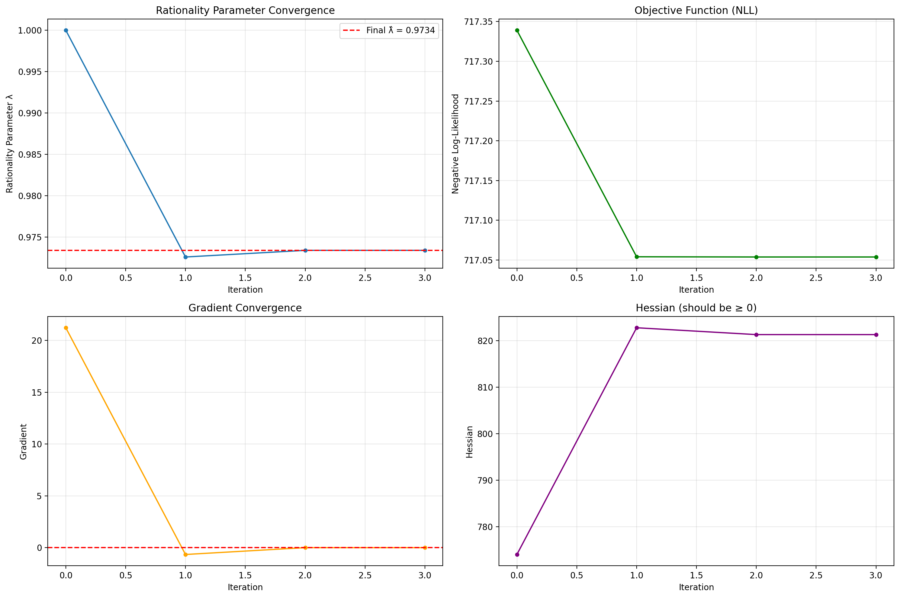
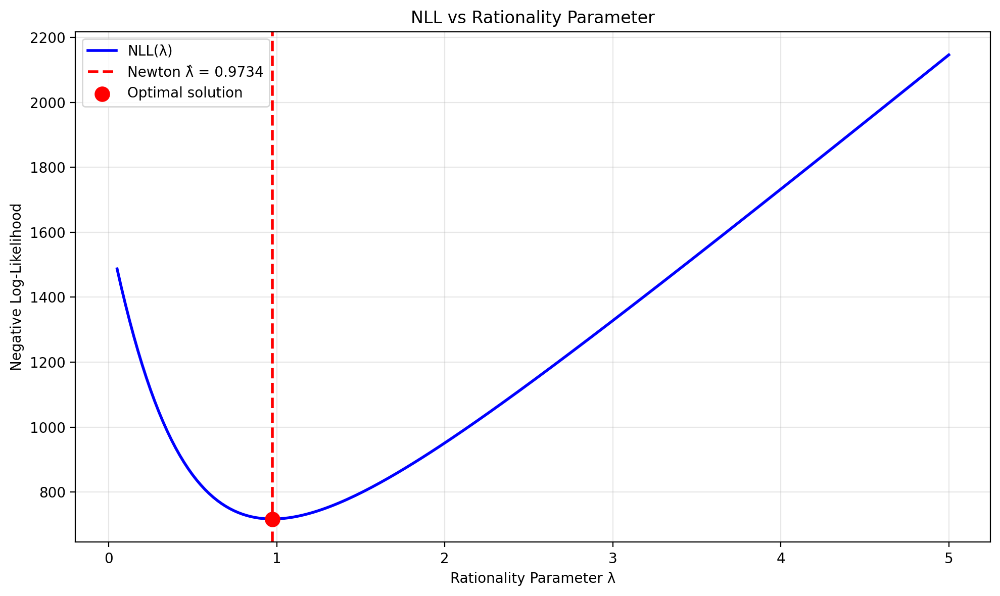

# Rationality & Alignment

## Rationality Parameter λ

The rationality parameter \(\lambda\) (inverse temperature) quantifies how consistently observed choices align with inferred preferences. Higher \(\lambda\) indicates more deterministic, utility-maximizing behavior, while lower \(\lambda\) indicates more random or noisy decision-making.

### Why Softmax Appears: Random Utility with Gumbel Shocks

**Step 1 — Random utility model**

$$
U_i = V_i + \varepsilon_i, \quad V_i = \mathbf{x}_i^\top \boldsymbol{\beta}
$$

where $V_i$ is the systematic utility and $\varepsilon_i$ captures unobserved effects.

Assume $\varepsilon_i$ are i.i.d. Gumbel (Type-I extreme value).

↓

**Step 2 — Gumbel-max result ⇒ softmax with rationality parameter**

Under the Gumbel assumption:

$$
P(\text{choose } i) = \frac{\exp(\lambda V_i)}{\sum_j \exp(\lambda V_j)}
$$

The parameter $\lambda > 0$ is an inverse noise scale:

- small $\lambda$: high randomness
- large $\lambda$: near-deterministic choice

↓

Interpretation: $\lambda$ measures how tightly behavior follows utility.

**Step 3 — Equivalent decision-theoretic view: utility vs entropy**

Instead of random utilities, we can view the agent as choosing a distribution over actions $p$:

$$
\max_{p \in \Delta} \sum_i p_i V_i + \frac{1}{\lambda} H(p), \quad H(p) = -\sum_i p_i \log p_i
$$

This objective trades off:

- expected utility
- entropy (randomness / flexibility)

↓

$\lambda$ controls how much randomness is penalized.

**Step 4 — Solving the entropy-regularized objective ⇒ softmax**

We solve:

$$
\max_{p \in \Delta} \sum_{i=1}^K p_i V_i - \frac{1}{\lambda} \sum_{i=1}^K p_i \log p_i \quad \text{s.t.} \quad \sum_i p_i = 1
$$

Lagrangian:

$$
L(p, \mu) = \sum_i p_i V_i - \frac{1}{\lambda} \sum_i p_i \log p_i + \mu\left(\sum_i p_i - 1\right)
$$

Optimality condition:

$$
\frac{\partial L}{\partial p_i} = 0 \quad \Rightarrow \quad V_i - \frac{1}{\lambda}(1 + \log p_i) + \mu = 0
$$

Rewriting:

$$
\log p_i = \lambda(V_i + \mu) - 1 \quad \Rightarrow \quad p_i \propto e^{\lambda V_i}
$$

Normalizing:

$$
p_i^*(\lambda) = \frac{e^{\lambda V_i}}{\sum_j e^{\lambda V_j}}
$$

↓

Softmax is the unique optimizer of the utility–entropy tradeoff.

**Step 5 — Binary purchase case: sigmoid with temperature**

For purchase decisions, let:

$$
V = \mathbf{x}^\top \boldsymbol{\beta}
$$

Then:

$$
P(y = 1 \mid \mathbf{x}, \boldsymbol{\beta}, \lambda) = \sigma(\lambda V) = \frac{1}{1 + e^{-\lambda V}}
$$

↓

$\lambda$ rescales confidence without changing preferences.

**Step 6 — What is fixed vs what is learned**

- $\boldsymbol{\beta}$: encodes what the shopper values
- $\lambda$: encodes how consistently they act on those values

After estimating $\hat{\boldsymbol{\beta}}$, we estimate $\lambda$ post-hoc by:

$$
\hat{\lambda} = \arg\max_{\lambda > 0} \sum_{n=1}^N \left[y_n \log \sigma(\lambda V_n) + (1 - y_n) \log(1 - \sigma(\lambda V_n))\right]
$$

↓

This isolates rationality from preference structure.

**Step 7 — First-order condition: matching predicted and observed behavior**

Let $p_n(\lambda) = \sigma(\lambda V_n)$. The gradient is:

$$
\ell'(\lambda) = \sum_{n=1}^N V_n (y_n - p_n(\lambda))
$$

At the optimum $\hat{\lambda}$:

$$
\sum_{n=1}^N V_n (y_n - \sigma(\hat{\lambda} V_n)) = 0
$$

Equivalently:

$$
\sum_{n=1}^N V_n y_n = \sum_{n=1}^N V_n \, \sigma(\hat{\lambda} V_n)
$$

↓

Observed utility-weighted purchases = model-predicted utility-weighted purchases.

**Step 8 — Curvature, Newton's method, and interpretation**

Second derivative:

$$
\ell''(\lambda) = -\sum_{n=1}^N V_n^2 \, \sigma(\lambda V_n)(1 - \sigma(\lambda V_n)) < 0
$$

So the objective is strictly concave. Newton update:

$$
\lambda_{t+1} = \lambda_t - \frac{\ell'(\lambda_t)}{\ell''(\lambda_t)}
$$

↓

This converges to a unique $\hat{\lambda}$.

**What $\lambda$ means in your project**

- **Behavioral**: consistency between inferred preferences and actions
- **Statistical**: temperature / calibration parameter
- **Economic**: inverse noise scale in random utility

- High $\hat{\lambda}$ → sharp, goal-aligned behavior
- Low $\hat{\lambda}$ → noisy, weakly aligned behavior

**What happens next**

- Estimate $\hat{\lambda}$ globally
- Estimate $\hat{\lambda}_c$ by context (weekend, holiday, traffic regime)
- Compare stability of $\lambda$ under distribution shifts
- Use drops in $\lambda$ as value-misalignment signals

## Estimation Procedure

We estimate \(\lambda\) post-hoc using Newton's method to maximize log-likelihood on validation data:

$$
\ell(\lambda) = \sum_i \left[\lambda y_i \eta_i - \log\left(1+e^{\lambda \eta_i}\right)\right]
$$

The negative log-likelihood is minimized:

$$
\mathrm{NLL}(\lambda) = \sum_i \left[\log\left(1+e^{\lambda \eta_i}\right) - \lambda y_i \eta_i\right]
$$

### Implementation

#### Negative Log-Likelihood Function

The negative log-likelihood function computes the objective to minimize:

```{python}
#| code-fold: true

import numpy as np

def negative_log_likelihood(lambda_rationality, logits, y_true):
    """
    Compute negative log-likelihood for rationality-scaled binary classification.
    Using sigmoid: p = σ(λ * η_i) where λ is rationality parameter (inverse temperature)
    
    Log-likelihood: ℓ(λ) = Σ[λ y_i η_i - log(1 + exp(λ η_i))]
    NLL(λ) = -ℓ(λ) = Σ[log(1 + exp(λ η_i)) - λ y_i η_i]
    """
    # Enforce λ > 0
    lambda_rationality = max(lambda_rationality, 1e-8)
    
    # Scale logits by rationality: z = λ * η_i
    z = lambda_rationality * logits
    
    # Numerically stable computation of log(1 + exp(z))
    log1p_exp_z = np.logaddexp(0, z)
    
    # NLL(λ) = Σ[log(1 + exp(λ η_i)) - λ y_i η_i]
    nll = np.sum(log1p_exp_z - lambda_rationality * y_true * logits)
    
    return nll
```

#### Gradient and Hessian

The gradient and Hessian are computed for Newton's method:

```{python}
#| code-fold: true

def gradient_nll(lambda_rationality, logits, y_true):
    """
    Compute gradient of NLL w.r.t. λ.
    d/dλ NLL(λ) = Σ[(p_i - y_i) * η_i] where p_i = σ(λ η_i)
    """
    lambda_rationality = max(lambda_rationality, 1e-8)
    z = lambda_rationality * logits
    p = 1.0 / (1.0 + np.exp(-np.clip(z, -500, 500)))
    grad = np.sum((p - y_true) * logits)
    return grad

def hessian_nll(lambda_rationality, logits, y_true):
    """
    Compute Hessian (second derivative) of NLL w.r.t. λ.
    d²/dλ² NLL(λ) = Σ[p_i(1-p_i) * η_i²] ≥ 0 (ensures convexity)
    """
    lambda_rationality = max(lambda_rationality, 1e-8)
    z = lambda_rationality * logits
    p = 1.0 / (1.0 + np.exp(-np.clip(z, -500, 500)))
    hess = np.sum(p * (1 - p) * logits ** 2)
    return hess
```

#### Newton's Method

Newton's method iteratively updates:

$$
\lambda_{\text{new}} = \lambda_{\text{old}} - \frac{\nabla \mathrm{NLL}}{\nabla^2 \mathrm{NLL}}
$$

where:
- **Gradient**: $\frac{d}{d\lambda}\mathrm{NLL} = \sum_i (p_i - y_i) \eta_i$
- **Hessian**: $\frac{d^2}{d\lambda^2}\mathrm{NLL} = \sum_i p_i(1-p_i) \eta_i^2 \geq 0$

The Hessian is always non-negative, ensuring convexity.

```{python}
#| code-fold: true

def newton_method_temperature(logits, y_true, lambda_init=1.0, tol=1e-6, max_iter=100):
    """
    Find optimal rationality parameter λ using Newton's method to minimize NLL.
    Newton update: λ_new = λ_old - grad / hess
    """
    lambda_curr = max(lambda_init, 1e-8)
    history = {'lambda': [lambda_curr], 'nll': [], 'grad': [], 'hess': []}
    
    for i in range(max_iter):
        nll = negative_log_likelihood(lambda_curr, logits, y_true)
        grad = gradient_nll(lambda_curr, logits, y_true)
        hess = hessian_nll(lambda_curr, logits, y_true)
        
        history['nll'].append(nll)
        history['grad'].append(grad)
        history['hess'].append(hess)
        
        # Check convergence
        if abs(grad) < tol:
            break
        
        # Newton step with damping
        if hess > 1e-10:
            step = grad / hess
            lambda_new = max(lambda_curr - step, 1e-8)
            lambda_curr = lambda_new
        
        history['lambda'].append(lambda_curr)
    
    return lambda_curr, history
```

#### Optimization Results

The following visualization shows the convergence of Newton's method:

```{python}
#| eval: true
#| code-fold: true
#| fig-cap: "Optimization convergence: rationality parameter, NLL, gradient, and Hessian"
#| fig-align: center
#| label: fig-optimization-convergence

from pathlib import Path
import matplotlib.pyplot as plt
import pickle

# Create output directory
outdir = Path("assets/figures")
outdir.mkdir(parents=True, exist_ok=True)

# Load results
with open('data/processed/rationality_temperature.pkl', 'rb') as f:
    rationality_results = pickle.load(f)

lambda_hat = rationality_results['lambda_hat']
history = rationality_results['optimization_history']

fig, axes = plt.subplots(2, 2, figsize=(15, 10))

axes[0, 0].plot(history['lambda'], marker='o', markersize=4)
axes[0, 0].axhline(y=lambda_hat, color='r', linestyle='--', label=f'Final λ̂ = {lambda_hat:.4f}')
axes[0, 0].set_xlabel('Iteration')
axes[0, 0].set_ylabel('Rationality Parameter λ')
axes[0, 0].set_title('Rationality Parameter Convergence')
axes[0, 0].legend()
axes[0, 0].grid(True, alpha=0.3)

axes[0, 1].plot(history['nll'], marker='o', markersize=4, color='green')
axes[0, 1].set_xlabel('Iteration')
axes[0, 1].set_ylabel('Negative Log-Likelihood')
axes[0, 1].set_title('Objective Function (NLL)')
axes[0, 1].grid(True, alpha=0.3)

axes[1, 0].plot(history['grad'], marker='o', markersize=4, color='orange')
axes[1, 0].axhline(y=0, color='r', linestyle='--')
axes[1, 0].set_xlabel('Iteration')
axes[1, 0].set_ylabel('Gradient')
axes[1, 0].set_title('Gradient Convergence')
axes[1, 0].grid(True, alpha=0.3)

axes[1, 1].plot(history['hess'], marker='o', markersize=4, color='purple')
axes[1, 1].set_xlabel('Iteration')
axes[1, 1].set_ylabel('Hessian')
axes[1, 1].set_title('Hessian (should be ≥ 0)')
axes[1, 1].grid(True, alpha=0.3)

plt.tight_layout()

# Save figure
outfile = outdir / "fig-optimization-convergence.png"
fig.savefig(outfile, dpi=200, bbox_inches="tight")
plt.close(fig)
print("Saved figure:", outfile)
```

{fig-cap="Optimization convergence: rationality parameter, NLL, gradient, and Hessian" fig-align="center" width=90%}


The optimization typically converges in 3-5 iterations, with the gradient approaching zero and the Hessian remaining positive, confirming the convexity of the objective function.

#### NLL Landscape

The negative log-likelihood as a function of \(\lambda\) is strictly convex, ensuring a unique global minimum:

```{python}
#| eval: true
#| code-fold: true
#| fig-cap: "Negative log-likelihood landscape showing optimal λ̂"
#| fig-align: center
#| label: fig-nll-landscape

from pathlib import Path
import matplotlib.pyplot as plt
import numpy as np
import pickle

# Create output directory
outdir = Path("assets/figures")
outdir.mkdir(parents=True, exist_ok=True)

# Load results and data
with open('data/processed/rationality_temperature.pkl', 'rb') as f:
    rationality_results = pickle.load(f)

lambda_hat = rationality_results['lambda_hat']
history = rationality_results['optimization_history']
logits_val = rationality_results['logits_validation']

# Load validation targets
y_val = np.load('data/processed/y_va.npy')

# Define NLL function for grid evaluation
def negative_log_likelihood(lambda_rationality, logits, y_true):
    lambda_rationality = max(lambda_rationality, 1e-8)
    z = lambda_rationality * logits
    log1p_exp_z = np.logaddexp(0, z)
    nll = np.sum(log1p_exp_z - lambda_rationality * y_true * logits)
    return nll

# Evaluate NLL over a grid
lambda_grid = np.linspace(0.05, 5.0, 200)
nll_grid = np.array([negative_log_likelihood(lam, logits_val, y_val) for lam in lambda_grid])

fig, ax = plt.subplots(1, 1, figsize=(10, 6))
ax.plot(lambda_grid, nll_grid, 'b-', linewidth=2, label='NLL(λ)')
ax.axvline(x=lambda_hat, color='r', linestyle='--', linewidth=2, label=f'Newton λ̂ = {lambda_hat:.4f}')
ax.scatter([lambda_hat], [history['nll'][-1]], color='red', s=100, zorder=5, label='Optimal solution')
ax.set_xlabel('Rationality Parameter λ')
ax.set_ylabel('Negative Log-Likelihood')
ax.set_title('NLL vs Rationality Parameter')
ax.legend()
ax.grid(True, alpha=0.3)
plt.tight_layout()

# Save figure
outfile = outdir / "fig-nll-landscape.png"
fig.savefig(outfile, dpi=200, bbox_inches="tight")
plt.close(fig)
print("Saved figure:", outfile)
```

{fig-cap="Negative log-likelihood landscape showing optimal λ̂" fig-align="center" width=90%}

The plot shows the smooth, convex NLL landscape with a clear minimum at the optimal \(\hat{\lambda}\), confirming that Newton's method finds the global optimum efficiently.

## Alignment Score

Alignment scores quantify how well observed behavior matches inferred preferences.

### Step 1 — Preference model (utility index)

$$
V_i = E[\boldsymbol{\beta}]^\top \mathbf{x}_i
$$

$\mathbf{x}_i$: session features, $E[\boldsymbol{\beta}]$: single preference vector (posterior mean).

↓

```{python}
#| code-fold: true
#| code-summary: "Show code for computing linear utility V"

import pickle
import numpy as np
import pandas as pd

# Load posterior estimates
with open('data/processed/pymc_posterior_estimates.pkl', 'rb') as f:
    pymc_results = pickle.load(f)

# Get posterior mean E[β]
beta_mean = pymc_results['beta_mean']

# Load validation features
X_val = pd.DataFrame(np.load('data/processed/X_vas.npy'))
with open('data/processed/feature_names.pkl', 'rb') as f:
    feature_names = pickle.load(f)
X_val.columns = feature_names
X_val_array = X_val.to_numpy(dtype=np.float64)

# Compute linear utility: V_i = E[β]ᵀ x_i
V = X_val_array @ beta_mean  # Shape: (n_samples,)

print(f"V shape: {V.shape}")
print(f"V range: [{V.min():.4f}, {V.max():.4f}]")
print(f"V mean: {V.mean():.4f}")
```

### Step 2 — Utility normalization (binary actions)

Actions $a \in \{0, 1\}$ with baseline set to zero:

$$
U_i(1) = V_i, \quad U_i(0) = 0
$$

This fixes the additive-constant ambiguity so utilities are interpreted relative to no-purchase.

↓

```{python}
#| code-fold: true
#| code-summary: "Show code for utility normalization"

# Utilities are defined as:
# U_i(1) = V_i, U_i(0) = 0
# (Implicit in following calculations - no separate code needed)

# Load observed actions
y_val = np.load('data/processed/y_va.npy')

print(f"Observed actions y shape: {y_val.shape}")
print(f"Action distribution: {np.bincount(y_val)}")
print("  - 0: no purchase (U=0)")
print("  - 1: purchase (U=V_i)")
```

### Step 3 — Optimal vs observed utility

Best achievable utility under the model:

$$
U_i^* = \max\{V_i, 0\}
$$

Observed action $y_i \in \{0, 1\}$ yields:

$$
U_i^{\text{obs}} = y_i \, V_i
$$

↓

```{python}
#| code-fold: true
#| code-summary: "Show code for computing optimal and observed utilities"

# Optimal utility: U_i* = max(V_i, 0)  (choose action 1 if V_i > 0, else 0)
U_star = np.maximum(V, 0.0)  # Shape: (n_samples,)

# Observed utility: U_iobs = y_i · V_i  (if y_i=1, get V_i; if y_i=0, get 0)
U_obs = y_val * V  # Shape: (n_samples,)

print(f"U_star shape: {U_star.shape}")
print(f"U_star range: [{U_star.min():.4f}, {U_star.max():.4f}]")
print(f"U_star mean: {U_star.mean():.4f}")
print(f"\nU_obs shape: {U_obs.shape}")
print(f"U_obs range: [{U_obs.min():.4f}, {U_obs.max():.4f}]")
print(f"U_obs mean: {U_obs.mean():.4f}")
```

### Step 4 — Regret (alignment gap)

$$
R_i = U_i^* - U_i^{\text{obs}} = \max\{V_i, 0\} - y_i V_i \quad \text{(clip } R_i \geq 0\text{)}
$$

Interpretation: how much utility is "left on the table" relative to the model-implied best action.

↓

```{python}
#| code-fold: true
#| code-summary: "Show code for computing regret"

# Compute regret: R_i = U_i* - U_iobs
regret = U_star - U_obs  # Shape: (n_samples,)

# Clip regret at 0 to avoid numerical negatives (sanity check)
regret = np.maximum(regret, 0.0)

print(f"Regret shape: {regret.shape}")
print(f"Regret range: [{regret.min():.4f}, {regret.max():.4f}]")
print(f"Regret mean: {regret.mean():.4f}")
print(f"Zero regret (perfect alignment): {np.sum(regret == 0)} ({100*np.mean(regret == 0):.2f}%)")
print(f"✓ All regret values are non-negative (min = {regret.min():.2e})")
```

### Step 5 — Rationality-weighted alignment score

With rationality $\hat{\lambda} > 0$ (estimated via NLL + constraint), define:

$$
S_i^{\text{align}} = \exp\left(-\hat{\lambda} \, R_i\right) \in (0, 1]
$$

High $S_i^{\text{align}}$ ⇔ low regret (behavior matches inferred preferences); $\hat{\lambda}$ makes deviations penalized more when behavior is more consistent/rational.

```{python}
#| code-fold: true
#| code-summary: "Show code for computing alignment score"

# Load optimal rationality parameter
with open('data/processed/rationality_temperature.pkl', 'rb') as f:
    rationality_results = pickle.load(f)

lambda_hat = rationality_results['lambda_hat']

# Compute alignment score: S_i = exp(−λ_hat · R_i)
S_align = np.exp(-lambda_hat * regret)  # Shape: (n_samples,)

print(f"λ̂ (rationality parameter): {lambda_hat:.6f}")
print(f"S_align shape: {S_align.shape}")
print(f"S_align range: [{S_align.min():.6f}, {S_align.max():.6f}]")
print(f"S_align mean: {S_align.mean():.6f}")
print(f"Perfect alignment (S=1.0): {np.sum(S_align == 1.0)} ({100*np.mean(S_align == 1.0):.2f}%)")
```

## Alignment Summary

## Figures

The following figures are generated from the rationality estimation analysis:

1. **Figure: Optimization Convergence** (`fig-optimization-convergence.png`)
   - Shows the convergence of Newton's method for estimating the rationality parameter λ
   - Displays four subplots: λ convergence, NLL, gradient, and Hessian over iterations
   - Located in: `assets/figures/fig-optimization-convergence.png`

2. **Figure: NLL Landscape** (`fig-nll-landscape.png`)
   - Visualizes the negative log-likelihood as a function of λ
   - Shows the optimal λ̂ found by Newton's method
   - Located in: `assets/figures/fig-nll-landscape.png`

## Code References

- **Alignment Notebook**: [`Writeups/04_alignment.ipynb`](/Writeups/04_alignment.ipynb)
- **Alignment Module**: [`src/alignment.py`](src/alignment.py)
- **Mathematical Derivation**: [`Writeups/rationality_derivation.pdf`](Writeups/rationality_derivation.pdf)

