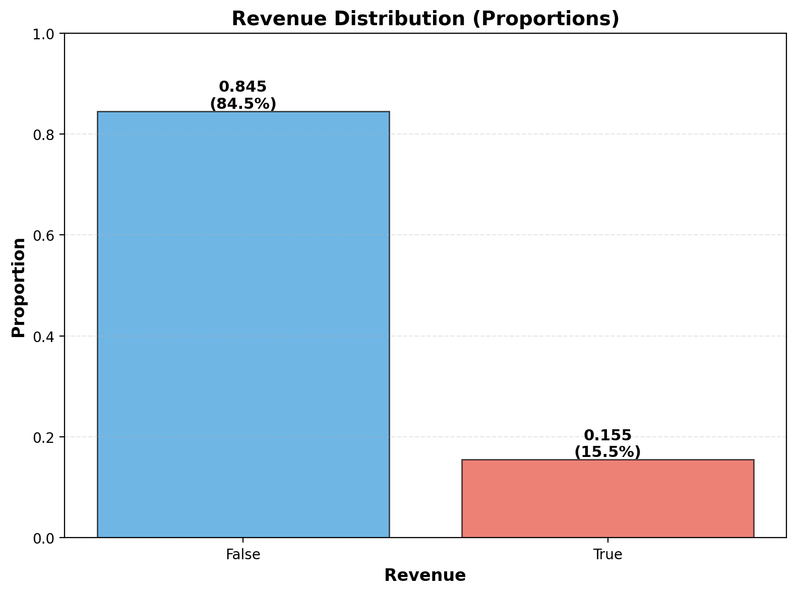
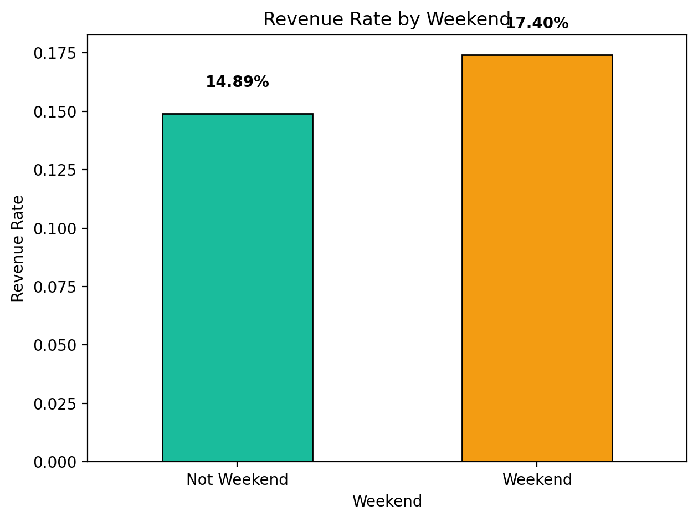
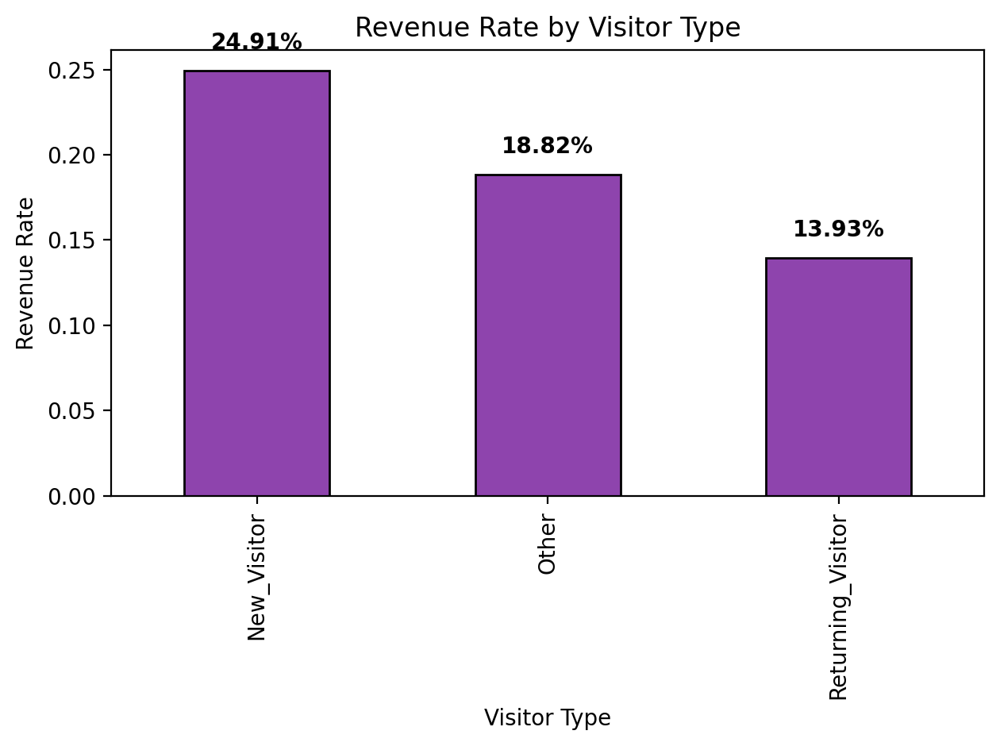
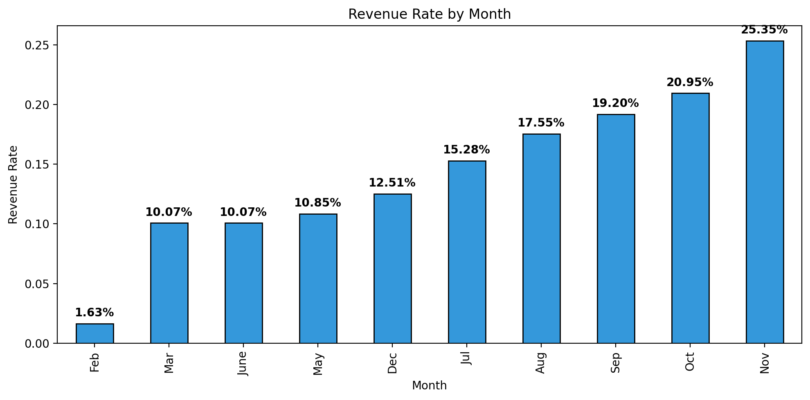
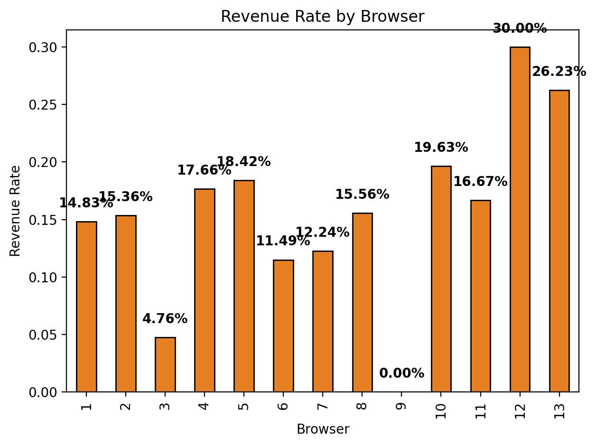
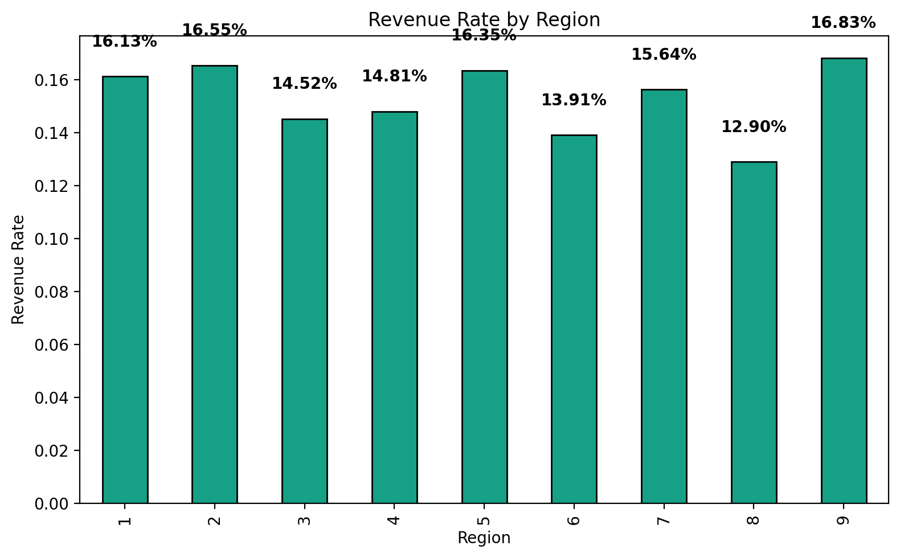
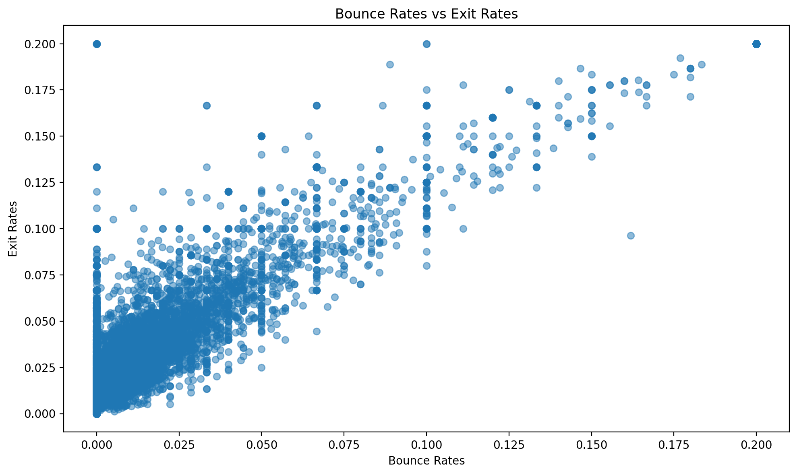
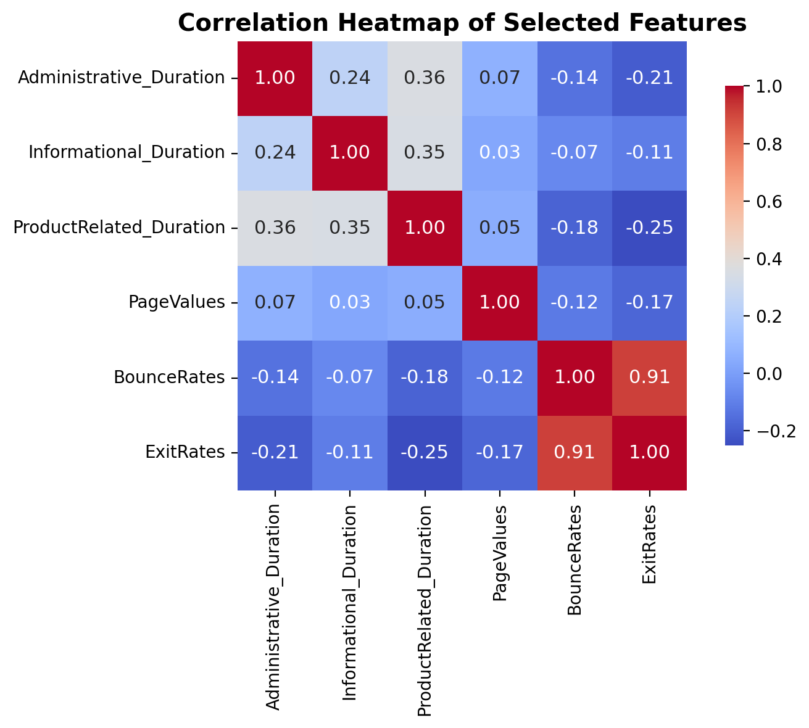

# Data & EDA

```{=html}
<style>
.sourceCode {
  text-align: left !important;
}
pre.sourceCode {
  text-align: left !important;
}
details {
  text-align: left;
}
details summary {
  text-align: left;
  cursor: pointer;
}
</style>
```

## Dataset Summary

The analysis uses the Online Shoppers Purchasing Intention dataset, which contains session-level aggregates of user behavior on an e-commerce website. Each row represents a single session with aggregated features across page categories (Administrative, Informational, ProductRelated), durations, and contextual metadata.

**Features:**

- **Page Categories**: 
  `Administrative`, `Administrative_Duration`, `Informational`, `Informational_Duration`, `ProductRelated`, `ProductRelated_Duration`

- **Engagement Metrics**: 
  `BounceRates`, `ExitRates`

- **Contextual Features**: 
  `Month`, `VisitorType`, `Weekend`, `SpecialDay`, `OperatingSystems`, 
  `Browser`, `Region`, `TrafficType`

- **Target Variable**: 
  `Revenue` (binary: purchase vs. no purchase)


## Target & Class Imbalance

The target variable `Revenue` indicates whether a purchase was made during the session. The dataset exhibits class imbalance, with a majority of sessions resulting in no purchase. This imbalance is accounted for by real life metrics which reflect a range of 5-10% of line visits resulting in a purchase. 


## Key EDA Findings

### Class Distribution

The following chart shows the distribution of the target variable `Revenue`, displaying the proportion of sessions that resulted in a purchase (True) versus no purchase (False). The dataset exhibits significant class imbalance, with approximately 84.5% of sessions not resulting in purchases and 15.5% resulting in purchases.

```{python}
#| eval: true
#| label: fig-revenue-distribution
#| fig-cap: "Distribution of the Revenue target variable showing proportions of purchase vs. no purchase"
#| echo: true
#| code-fold: true
#| code-summary: "Show code"
#| fig-align: center

from pathlib import Path
import pandas as pd
import numpy as np
import matplotlib.pyplot as plt

# Create output directory
outdir = Path("assets/figures")
outdir.mkdir(parents=True, exist_ok=True)

# Load data
df = pd.read_csv('data/online_shoppers_intention.csv')

# Get proportions
revenue_counts = df["Revenue"].value_counts()
revenue_props = df["Revenue"].value_counts(normalize=True)

# Create a single figure for proportions
fig, ax = plt.subplots(figsize=(8, 6))

# Bar chart with proportions
bars = ax.bar(revenue_props.index.astype(str), revenue_props.values, 
              color=['#3498db', '#e74c3c'], alpha=0.7, edgecolor='black')
ax.set_xlabel('Revenue', fontsize=12, fontweight='bold')
ax.set_ylabel('Proportion', fontsize=12, fontweight='bold')
ax.set_title('Revenue Distribution (Proportions)', fontsize=14, fontweight='bold')
ax.set_ylim([0, 1])
ax.grid(axis='y', alpha=0.3, linestyle='--')

# Add proportion labels on bars
for bar in bars:
    height = bar.get_height()
    ax.text(bar.get_x() + bar.get_width()/2., height,
            f'{height:.3f}\n({height*100:.1f}%)',
            ha='center', va='bottom', fontsize=11, fontweight='bold')

plt.tight_layout()

# Save figure
outfile = outdir / "fig-revenue-distribution.png"
fig.savefig(outfile, dpi=200, bbox_inches="tight")
plt.close(fig)
print("Saved figure:", outfile)
```

{fig-cap="Distribution of the Revenue target variable showing proportions of purchase vs. no purchase" fig-align="center" width=90%}

*Code reference: See the full implementation in [`Writeups/notebooks/01_eda.ipynb`](Writeups/notebooks/01_eda.ipynb) (Cell 11)*

### Feature Distributions

The following sections show revenue rates across different categorical features, providing insights into how different factors influence purchase behavior.

**Revenue Rate by Weekend**

```{python}
#| eval: true
#| label: fig-revenue-weekend
#| fig-cap: "Revenue rate by Weekend"
#| echo: true
#| code-fold: true
#| code-summary: "Show code"
#| fig-align: center

from pathlib import Path
import pandas as pd
import matplotlib.pyplot as plt

# Create output directory
outdir = Path("assets/figures")
outdir.mkdir(parents=True, exist_ok=True)

# Load data
df = pd.read_csv('data/online_shoppers_intention.csv')

# Revenue rate by Weekend
print("Revenue rate by Weekend:")
weekend_revenue = df.groupby("Weekend")["Revenue"].mean()
print(weekend_revenue)

fig, ax = plt.subplots()
weekend_revenue.plot(kind="bar", ax=ax, color=["#1abc9c", "#f39c12"], edgecolor='black')
ax.set_ylabel("Revenue Rate")
ax.set_xlabel("Weekend")
ax.set_title("Revenue Rate by Weekend")
ax.set_xticklabels(['Not Weekend', 'Weekend'], rotation=0)
for i, v in enumerate(weekend_revenue):
    ax.text(i, v + 0.01, f"{v:.2%}", ha='center', va='bottom', fontweight='bold')
plt.tight_layout()

# Save figure
outfile = outdir / "fig-revenue-weekend.png"
fig.savefig(outfile, dpi=200, bbox_inches="tight")
plt.close(fig)
print("Saved figure:", outfile)
```

{fig-cap="Revenue rate by Weekend" fig-align="center" width=90%}

*Code reference: See [`Writeups/notebooks/01_eda.ipynb`](Writeups/notebooks/01_eda.ipynb) (Cell 12, Weekend section)*

**Revenue Rate by Visitor Type**

```{python}
#| eval: true
#| label: fig-revenue-visitor
#| fig-cap: "Revenue rate by Visitor Type"
#| echo: true
#| code-fold: true
#| code-summary: "Show code"
#| fig-align: center

from pathlib import Path
import pandas as pd
import matplotlib.pyplot as plt

# Create output directory
outdir = Path("assets/figures")
outdir.mkdir(parents=True, exist_ok=True)

# Load data
df = pd.read_csv('data/online_shoppers_intention.csv')

# Revenue rate by VisitorType
print("Revenue rate by VisitorType:")
visitor_revenue = df.groupby("VisitorType")["Revenue"].mean()
print(visitor_revenue)

fig, ax = plt.subplots()
visitor_revenue.plot(kind="bar", ax=ax, color="#8e44ad", edgecolor='black')
ax.set_ylabel("Revenue Rate")
ax.set_xlabel("Visitor Type")
ax.set_title("Revenue Rate by Visitor Type")
for i, v in enumerate(visitor_revenue):
    ax.text(i, v + 0.01, f"{v:.2%}", ha='center', va='bottom', fontweight='bold')
plt.tight_layout()

# Save figure
outfile = outdir / "fig-revenue-visitor.png"
fig.savefig(outfile, dpi=200, bbox_inches="tight")
plt.close(fig)
print("Saved figure:", outfile)
```

{fig-cap="Revenue rate by Visitor Type" fig-align="center" width=90%}

*Code reference: See [`Writeups/notebooks/01_eda.ipynb`](Writeups/notebooks/01_eda.ipynb) (Cell 12, VisitorType section)*

**Revenue Rate by Month**

```{python}
#| eval: true
#| label: fig-revenue-month
#| fig-cap: "Revenue rate by Month"
#| echo: true
#| code-fold: true
#| code-summary: "Show code"
#| fig-align: center

from pathlib import Path
import pandas as pd
import matplotlib.pyplot as plt

# Create output directory
outdir = Path("assets/figures")
outdir.mkdir(parents=True, exist_ok=True)

# Load data
df = pd.read_csv('data/online_shoppers_intention.csv')

# Revenue rate by Month
print("Revenue rate by Month:")
month_revenue = df.groupby("Month")["Revenue"].mean().sort_values()
print(month_revenue)

fig, ax = plt.subplots(figsize=(10,5))
month_revenue.plot(kind="bar", ax=ax, color="#3498db", edgecolor='black')
ax.set_ylabel("Revenue Rate")
ax.set_xlabel("Month")
ax.set_title("Revenue Rate by Month")
for i, v in enumerate(month_revenue):
    ax.text(i, v + 0.004, f"{v:.2%}", ha='center', va='bottom', fontweight='bold')
plt.tight_layout()

# Save figure
outfile = outdir / "fig-revenue-month.png"
fig.savefig(outfile, dpi=200, bbox_inches="tight")
plt.close(fig)
print("Saved figure:", outfile)
```

{fig-cap="Revenue rate by Month" fig-align="center" width=90%}

*Code reference: See [`Writeups/notebooks/01_eda.ipynb`](Writeups/notebooks/01_eda.ipynb) (Cell 12, Month section)*

**Revenue Rate by Browser**

```{python}
#| eval: true
#| label: fig-revenue-browser
#| fig-cap: "Revenue rate by Browser"
#| echo: true
#| code-fold: true
#| code-summary: "Show code"
#| fig-align: center

from pathlib import Path
import pandas as pd
import matplotlib.pyplot as plt

# Create output directory
outdir = Path("assets/figures")
outdir.mkdir(parents=True, exist_ok=True)

# Load data
df = pd.read_csv('data/online_shoppers_intention.csv')

# Revenue rate by Browser
print("Revenue rate by Browser:")
browser_revenue = df.groupby("Browser")["Revenue"].mean()
print(browser_revenue)

fig, ax = plt.subplots()
browser_revenue.plot(kind="bar", ax=ax, color="#e67e22", edgecolor='black')
ax.set_ylabel("Revenue Rate")
ax.set_xlabel("Browser")
ax.set_title("Revenue Rate by Browser")
for i, v in enumerate(browser_revenue):
    ax.text(i, v + 0.01, f"{v:.2%}", ha='center', va='bottom', fontweight='bold')
plt.tight_layout()

# Save figure
outfile = outdir / "fig-revenue-browser.png"
fig.savefig(outfile, dpi=200, bbox_inches="tight")
plt.close(fig)
print("Saved figure:", outfile)
```

{fig-cap="Revenue rate by Browser" fig-align="center" width=90%}

*Code reference: See [`Writeups/notebooks/01_eda.ipynb`](Writeups/notebooks/01_eda.ipynb) (Cell 12, Browser section)*

**Revenue Rate by Region**

```{python}
#| eval: true
#| label: fig-revenue-region
#| fig-cap: "Revenue rate by Region"
#| echo: true
#| code-fold: true
#| code-summary: "Show code"
#| fig-align: center

from pathlib import Path
import pandas as pd
import matplotlib.pyplot as plt

# Create output directory
outdir = Path("assets/figures")
outdir.mkdir(parents=True, exist_ok=True)

# Load data
df = pd.read_csv('data/online_shoppers_intention.csv')

# Revenue rate by Region
print("Revenue rate by Region:")
region_revenue = df.groupby("Region")["Revenue"].mean()
print(region_revenue)

fig, ax = plt.subplots(figsize=(8,5))
region_revenue.plot(kind="bar", ax=ax, color="#16a085", edgecolor='black')
ax.set_ylabel("Revenue Rate")
ax.set_xlabel("Region")
ax.set_title("Revenue Rate by Region")
for i, v in enumerate(region_revenue):
    ax.text(i, v + 0.01, f"{v:.2%}", ha='center', va='bottom', fontweight='bold')
plt.tight_layout()

# Save figure
outfile = outdir / "fig-revenue-region.png"
fig.savefig(outfile, dpi=200, bbox_inches="tight")
plt.close(fig)
print("Saved figure:", outfile)
```

{fig-cap="Revenue rate by Region" fig-align="center" width=90%}

*Code reference: See [`Writeups/notebooks/01_eda.ipynb`](Writeups/notebooks/01_eda.ipynb) (Cell 12, Region section)*

### Duplicate Handling

Repeated sessions were retained during EDA, as duplicate rows correspond to independent realizations of user behavior rather than data redundancy. Preserving these observations is necessary to accurately characterize empirical distributions and frequency-based relationships relevant for preference and alignment inference.

```{python}
#| echo: true
#| output: true

import pandas as pd

# Load data
df = pd.read_csv('data/online_shoppers_intention.csv')

# Check for duplicate rows
df.duplicated().sum()
```

*Code reference: See [`Writeups/notebooks/01_eda.ipynb`](Writeups/notebooks/01_eda.ipynb) (Cell 9)*

### Engagement Metrics

The following scatter plot visualizes the relationship between Bounce Rates and Exit Rates, two key engagement metrics that measure user disengagement at different stages of a session.

BounceRates and ExitRates exhibit a strong positive association, indicating that pages with higher immediate disengagement also tend to be session termination points. In practice, both metrics capture related forms of disengagement, differing mainly in whether users leave immediately or later in the session.

```{python}
#| eval: true
#| label: fig-bounce-exit
#| fig-cap: "Scatter plot of Bounce Rates vs Exit Rates"
#| echo: true
#| code-fold: true
#| code-summary: "Show code"
#| fig-align: center

from pathlib import Path
import pandas as pd
import matplotlib.pyplot as plt

# Create output directory
outdir = Path("assets/figures")
outdir.mkdir(parents=True, exist_ok=True)

# Load data
df = pd.read_csv('data/online_shoppers_intention.csv')

# Create a scatter plot of bounce rates vs exit rates
fig, ax = plt.subplots(figsize=(10, 6))
ax.scatter(df['BounceRates'], df['ExitRates'], alpha=0.5)
ax.set_xlabel('Bounce Rates')
ax.set_ylabel('Exit Rates')
ax.set_title('Bounce Rates vs Exit Rates')
plt.tight_layout()

# Save figure
outfile = outdir / "fig-bounce-exit.png"
fig.savefig(outfile, dpi=200, bbox_inches="tight")
plt.close(fig)
print("Saved figure:", outfile)
```

{fig-cap="Scatter plot of Bounce Rates vs Exit Rates" fig-align="center" width=90%}

*Code reference: See [`Writeups/notebooks/01_eda.ipynb`](Writeups/notebooks/01_eda.ipynb) (Cell 13)*

### Correlation Matrix

The correlation matrix highlights a clear separation between engagement-related and disengagement-related behaviors. Session duration features (Administrative, Informational, and ProductRelated) exhibit moderate positive correlations with one another, reflecting that longer engagement in one area often coincides with longer engagement elsewhere. In contrast, BounceRates and ExitRates show consistent negative correlations with duration and PageValues, indicating that higher disengagement is associated with shorter sessions and lower commercial value. Notably, BounceRates and ExitRates are highly correlated with each other, suggesting that they capture closely related aspects of user disengagement. This strong association signals potential multicollinearity, motivating careful interpretation and regularization in downstream modeling rather than treating them as independent drivers.

```{python}
#| eval: true
#| label: fig-correlation-matrix
#| fig-cap: "Correlation heatmap of selected features"
#| echo: true
#| code-fold: true
#| code-summary: "Show code"
#| fig-align: center

from pathlib import Path
import pandas as pd
import matplotlib.pyplot as plt
import seaborn as sns

# Create output directory
outdir = Path("assets/figures")
outdir.mkdir(parents=True, exist_ok=True)

# Load data
df = pd.read_csv('data/online_shoppers_intention.csv')

# Correlation matrix heatmap for selected features
selected_features = [
    'Administrative_Duration',
    'Informational_Duration',
    'ProductRelated_Duration',
    'PageValues',
    'BounceRates',
    'ExitRates'
]

corr_matrix = df[selected_features].corr()

fig, ax = plt.subplots(figsize=(8, 6))
sns.heatmap(corr_matrix, annot=True, cmap='coolwarm', fmt=".2f", square=True, 
            cbar_kws={"shrink": .8}, annot_kws={"size":11}, ax=ax)
ax.set_title('Correlation Heatmap of Selected Features', fontsize=14, fontweight='bold')
plt.tight_layout()

# Save figure
outfile = outdir / "fig-correlation-matrix.png"
fig.savefig(outfile, dpi=200, bbox_inches="tight")
plt.close(fig)
print("Saved figure:", outfile)
```

{fig-cap="Correlation heatmap of selected features" fig-align="center" width=90%}

*Code reference: See [`Writeups/notebooks/01_eda.ipynb`](Writeups/notebooks/01_eda.ipynb) (Cell 14)*

## Key Findings from Exploratory Analysis

- **Time Allocation**: Sessions show varying distributions of time across page categories
- **Contextual Effects**: Weekend and SpecialDay show notable differences in conversion rates
- **Traffic Sources**: Different traffic types exhibit distinct behavioral patterns
- **Multicollinearity**: BounceRates and ExitRates show high correlation, indicating potential multicollinearity that requires careful handling in modeling
- **Compositional Data**: Duration and count features (Administrative, Informational, ProductRelated) represent compositional data that must be properly transformed to account for their constrained sum structure before modeling

## Figures

The following figures are generated from the exploratory data analysis:

1. **Figure: Revenue Distribution** (`fig-revenue-distribution.png`)
   - Bar chart showing the proportion of sessions with purchase vs. no purchase
   - Located in: `assets/figures/fig-revenue-distribution.png`

2. **Figure: Revenue Rate by Weekend** (`fig-revenue-weekend.png`)
   - Bar chart comparing conversion rates for weekend vs. non-weekend sessions
   - Located in: `assets/figures/fig-revenue-weekend.png`

3. **Figure: Revenue Rate by Visitor Type** (`fig-revenue-visitor.png`)
   - Bar chart showing conversion rates by visitor type (New Visitor, Returning Visitor, Other)
   - Located in: `assets/figures/fig-revenue-visitor.png`

4. **Figure: Revenue Rate by Month** (`fig-revenue-month.png`)
   - Bar chart showing conversion rates across different months
   - Located in: `assets/figures/fig-revenue-month.png`

5. **Figure: Revenue Rate by Browser** (`fig-revenue-browser.png`)
   - Bar chart showing conversion rates by browser type
   - Located in: `assets/figures/fig-revenue-browser.png`

6. **Figure: Revenue Rate by Region** (`fig-revenue-region.png`)
   - Bar chart showing conversion rates by geographic region
   - Located in: `assets/figures/fig-revenue-region.png`

7. **Figure: Bounce Rates vs Exit Rates** (`fig-bounce-exit.png`)
   - Scatter plot showing the relationship between bounce rates and exit rates
   - Located in: `assets/figures/fig-bounce-exit.png`

8. **Figure: Correlation Matrix** (`fig-correlation-matrix.png`)
   - Heatmap showing correlations between selected numerical features
   - Located in: `assets/figures/fig-correlation-matrix.png`

## Code References

- **Full EDA Notebook**: [`Writeups/notebooks/01_eda.ipynb`](Writeups/notebooks/01_eda.ipynb)
- **Data Module**: [`src/data.py`](src/data.py)

