# Evaluation & Robustness

**Note:** All metrics and analyses presented in this section have been calculated from the validation dataset (last 2,322 rows of the full dataset, representing November and December sessions).

## Alignment Summary

### Distribution and Summary Statistics

The following visualization and statistics summarize the alignment metrics across all sessions:

```{python}
#| eval: true
#| code-fold: true
#| code-summary: "Show code for loading data and generating histogram"

from pathlib import Path
import pandas as pd
import numpy as np
import matplotlib.pyplot as plt

# Create output directory
outdir = Path("assets/figures")
outdir.mkdir(parents=True, exist_ok=True)

# Load alignment metrics (try parquet first, fallback to CSV)
try:
    results_df = pd.read_parquet('data/processed/alignment_metrics.parquet')
except Exception:
    results_df = pd.read_csv('data/processed/alignment_metrics.csv')

# Create histogram of alignment scores
fig, ax = plt.subplots(1, 1, figsize=(10, 6))
ax.hist(results_df['S_align'], bins=50, edgecolor='black', alpha=0.7, color='steelblue')
ax.set_xlabel('Alignment Score (S_align)', fontsize=12)
ax.set_ylabel('Frequency', fontsize=12)
ax.set_title('Distribution of Alignment Scores', fontsize=14)
ax.axvline(x=results_df['S_align'].mean(), color='red', linestyle='--', linewidth=2, 
           label=f'Mean = {results_df["S_align"].mean():.4f}')
ax.axvline(x=results_df['S_align'].median(), color='green', linestyle='--', linewidth=2, 
           label=f'Median = {results_df["S_align"].median():.4f}')
ax.legend()
ax.grid(True, alpha=0.3)
plt.tight_layout()

# Save figure
outfile = outdir / "fig-alignment-histogram.png"
fig.savefig(outfile, dpi=200, bbox_inches="tight")
plt.close(fig)
print("Saved figure:", outfile)
```

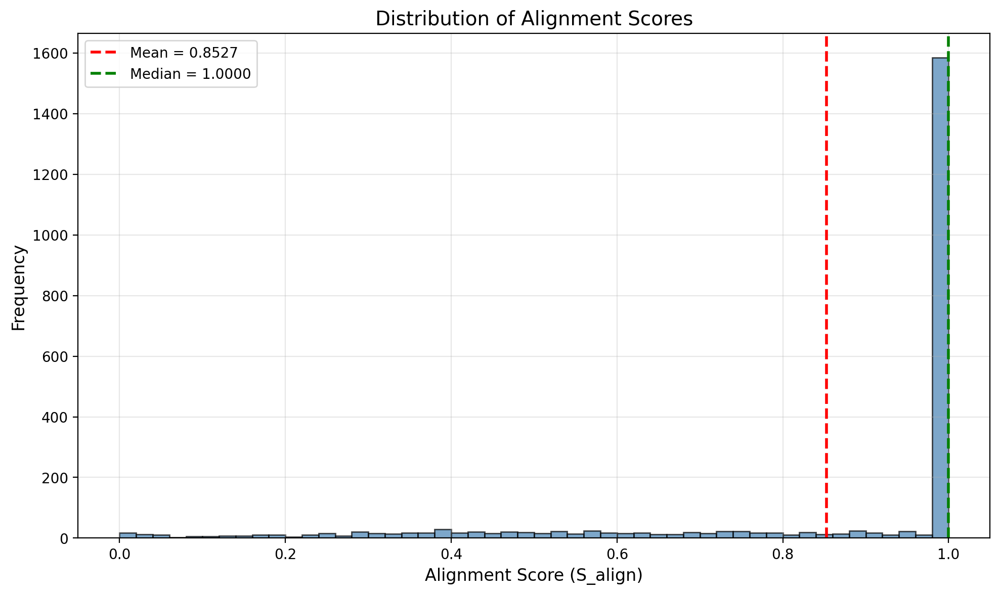{fig-cap="Distribution of alignment scores (S_align) across all sessions" fig-align="center" width=90%}

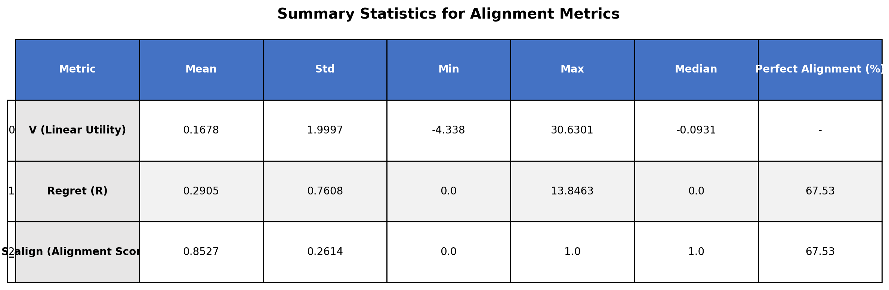{fig-cap="Summary statistics table for alignment metrics" fig-align="center" width=90%}

```{python}
#| eval: true
#| code-fold: true
#| code-summary: "Show code for computing summary statistics table"

from pathlib import Path
import pandas as pd
import numpy as np
import matplotlib.pyplot as plt
from matplotlib.patches import Rectangle

# Create output directory
outdir = Path("assets/figures")
outdir.mkdir(parents=True, exist_ok=True)

# Load alignment metrics (try parquet first, fallback to CSV)
try:
    results_df = pd.read_parquet('data/processed/alignment_metrics.parquet')
except Exception:
    results_df = pd.read_csv('data/processed/alignment_metrics.csv')

# Compute summary statistics for key metrics
summary_data = {
    'Metric': ['V (Linear Utility)', 'Regret (R)', 'S_align (Alignment Score)'],
    'Mean': [
        results_df['V'].mean(),
        results_df['regret'].mean(),
        results_df['S_align'].mean()
    ],
    'Std': [
        results_df['V'].std(),
        results_df['regret'].std(),
        results_df['S_align'].std()
    ],
    'Min': [
        results_df['V'].min(),
        results_df['regret'].min(),
        results_df['S_align'].min()
    ],
    'Max': [
        results_df['V'].max(),
        results_df['regret'].max(),
        results_df['S_align'].max()
    ],
    'Median': [
        results_df['V'].median(),
        results_df['regret'].median(),
        results_df['S_align'].median()
    ]
}

summary_stats = pd.DataFrame(summary_data)

# Round to 4 decimal places
for col in ['Mean', 'Std', 'Min', 'Max', 'Median']:
    summary_stats[col] = summary_stats[col].round(4)

# Add percentage of perfect alignment
summary_stats['Perfect Alignment (%)'] = [
    np.nan,
    (results_df['regret'] == 0).sum() / len(results_df) * 100,
    (results_df['S_align'] == 1.0).sum() / len(results_df) * 100
]

# Round the percentage column
summary_stats['Perfect Alignment (%)'] = summary_stats['Perfect Alignment (%)'].round(2)

# Create table figure
fig, ax = plt.subplots(figsize=(12, 4))
ax.axis('tight')
ax.axis('off')

# Format the dataframe for display (replace NaN with '-')
summary_display = summary_stats.copy()
summary_display = summary_display.fillna('-')

# Create table
table = ax.table(cellText=summary_display.values,
                colLabels=summary_display.columns,
                rowLabels=summary_display.index,
                cellLoc='center',
                loc='center',
                bbox=[0, 0, 1, 1])

table.auto_set_font_size(False)
table.set_fontsize(10)
table.scale(1, 2)

# Style the header row
for i in range(len(summary_display.columns)):
    table[(0, i)].set_facecolor('#4472C4')
    table[(0, i)].set_text_props(weight='bold', color='white')

# Style the first column (metric names)
for i in range(1, len(summary_display) + 1):
    table[(i, 0)].set_facecolor('#E7E6E6')
    table[(i, 0)].set_text_props(weight='bold')

# Alternate row colors
for i in range(1, len(summary_display) + 1):
    for j in range(1, len(summary_display.columns)):
        if i % 2 == 0:
            table[(i, j)].set_facecolor('#F2F2F2')
        else:
            table[(i, j)].set_facecolor('white')

plt.title('Summary Statistics for Alignment Metrics', fontsize=14, fontweight='bold', pad=20)
plt.tight_layout()

# Save figure
outfile = outdir / "fig-alignment-summary-stats.png"
fig.savefig(outfile, dpi=200, bbox_inches="tight")
plt.close(fig)
print("Saved figure:", outfile)

# Display the dataframe
summary_stats
```

The alignment metrics reveal the distribution of how well observed behavior matches inferred preferences across all validation sessions. The histogram shows the distribution of alignment scores, with higher scores indicating better alignment between observed actions and inferred preferences.

## Contextual Shifts

Show how rationality-weighted alignment varies across context, consistent with the interpretation that alignment captures behavioral coherence under different decision environments.

### Weekend vs Weekday Analysis

```{python}
#| eval: true
#| code-fold: true
#| code-summary: "Show code for loading data and computing summaries"

import pandas as pd
import numpy as np
import matplotlib.pyplot as plt
import seaborn as sns
from pathlib import Path

# Load alignment metrics
try:
    results_df = pd.read_parquet('data/processed/alignment_metrics.parquet')
except Exception:
    results_df = pd.read_csv('data/processed/alignment_metrics.csv')

# Load original dataset and get validation rows
df_original = pd.read_csv('data/online_shoppers_intention.csv')
n_val = len(results_df)
df_context = df_original.iloc[-n_val:][['Weekend', 'Month', 'TrafficType']].reset_index(drop=True)
df_combined = pd.concat([results_df.reset_index(drop=True), df_context], axis=1)

# Compute weekend summary
weekend_summary = df_combined.groupby('Weekend')['S_align'].agg(['mean', 'median', 'count'])
print("Weekend vs Weekday Summary:")
print(weekend_summary)
```

```{python}
#| eval: true

# Create output directory
outdir = Path("assets/figures")
outdir.mkdir(parents=True, exist_ok=True)

# Plot weekend vs weekday boxplot
plt.figure(figsize=(8, 6))
sns.boxplot(data=df_combined, x='Weekend', y='S_align', hue='Weekend', palette=['lightblue', 'lightcoral'], legend=False)
plt.xlabel('Day Type', fontsize=12)
plt.ylabel('Alignment Score (S_align)', fontsize=12)
plt.title('Alignment Score Distribution: Weekday vs Weekend', fontsize=14)
plt.xticks([False, True], ['Weekday', 'Weekend'])
plt.grid(True, alpha=0.3, axis='y')
plt.tight_layout()

# Save figure
outfile = outdir / "fig-pillar3-weekend.png"
plt.savefig(outfile, dpi=200, bbox_inches="tight")
plt.close()
print("Saved figure:", outfile)
```

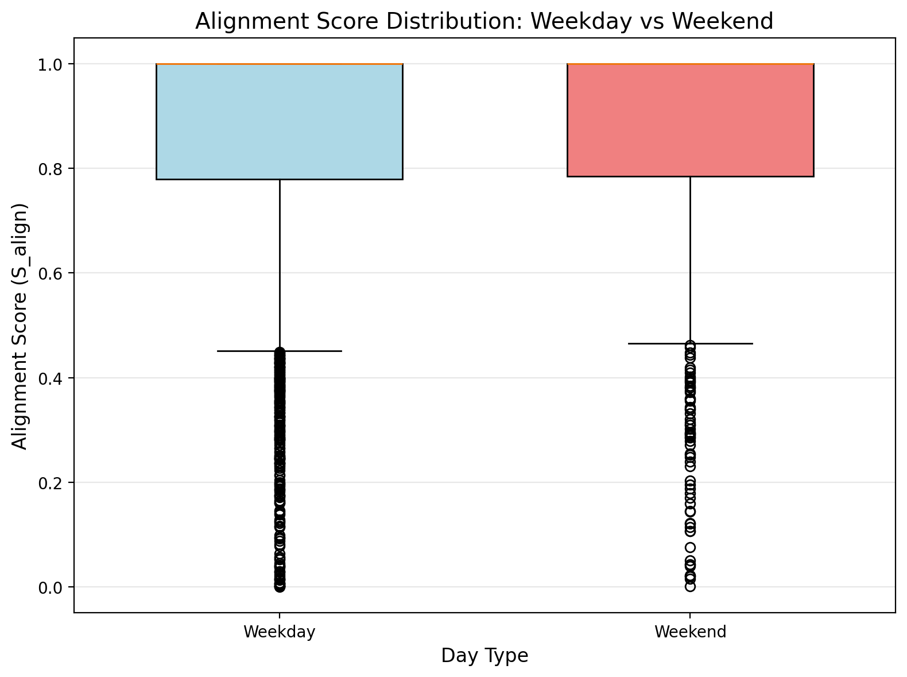{fig-cap="Alignment score distribution: Weekday vs Weekend" fig-align="center" width=90%}

Weekday and weekend alignment score distributions are nearly identical, indicating that inferred shopper preferences and rationality remain stable across day types. This suggests that purchasing behavior does not exhibit systematic misalignment under this contextual shift, and the learned utility model generalizes consistently across time-based segments.

### Month Analysis

```{python}
#| eval: true
#| code-fold: true
#| code-summary: "Show code for computing month summaries"

if 'Month' in df_combined.columns:
    month_summary = df_combined.groupby('Month')['S_align'].agg(['mean', 'median', 'count']).reset_index()
    month_summary = month_summary.sort_values('mean')
    print("Month Summary:")
    print(month_summary.sort_values('mean', ascending=False))
else:
    print("Month column not found")
```

```{python}
#| eval: true

if 'Month' in df_combined.columns:
    # Plot mean S_align by Month
    plt.figure(figsize=(10, 6))
    plt.plot(month_summary['Month'], month_summary['mean'], marker='o', linewidth=2, markersize=8)
    plt.xlabel('Month', fontsize=12)
    plt.ylabel('Mean Alignment Score (S_align)', fontsize=12)
    plt.title('Mean Alignment Score by Month (Validation Period: Nov-Dec)', fontsize=14)
    plt.xticks(rotation=45, ha='right')
    plt.grid(True, alpha=0.3)
    plt.tight_layout()
    
    # Save figure
    outfile = outdir / "fig-pillar3-month.png"
    plt.savefig(outfile, dpi=200, bbox_inches="tight")
    plt.close()
    print("Saved figure:", outfile)
```

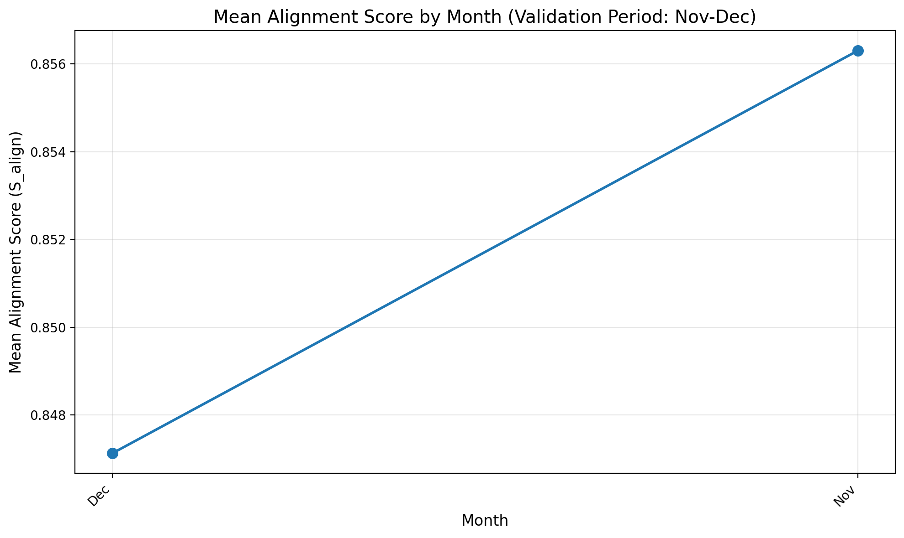{fig-cap="Mean alignment score by month (validation period: November and December only)" fig-align="center" width=90%}

### TrafficType Analysis

```{python}
#| eval: true
#| code-fold: true
#| code-summary: "Show code for computing TrafficType summaries"

if 'TrafficType' in df_combined.columns:
    traffic_summary = df_combined.groupby('TrafficType')['S_align'].agg(['mean', 'median', 'count']).reset_index()
    traffic_summary = traffic_summary.sort_values('mean')
    print("TrafficType Summary:")
    print(traffic_summary.sort_values('mean', ascending=False))
else:
    print("TrafficType column not found")
```

```{python}
#| eval: true

if 'TrafficType' in df_combined.columns:
    # Plot mean S_align by TrafficType
    plt.figure(figsize=(12, 6))
    plt.barh(range(len(traffic_summary)), traffic_summary['mean'], 
             color=plt.cm.viridis(np.linspace(0, 1, len(traffic_summary))))
    plt.yticks(range(len(traffic_summary)), [f'Type {t}' for t in traffic_summary['TrafficType']])
    plt.xlabel('Mean Alignment Score (S_align)', fontsize=12)
    plt.ylabel('Traffic Type', fontsize=12)
    plt.title('Mean Alignment Score by Traffic Type (sorted by mean)', fontsize=14)
    plt.grid(True, alpha=0.3, axis='x')
    plt.tight_layout()
    
    # Save figure
    outfile = outdir / "fig-pillar3-traffic.png"
    plt.savefig(outfile, dpi=200, bbox_inches="tight")
    plt.close()
    print("Saved figure:", outfile)
```

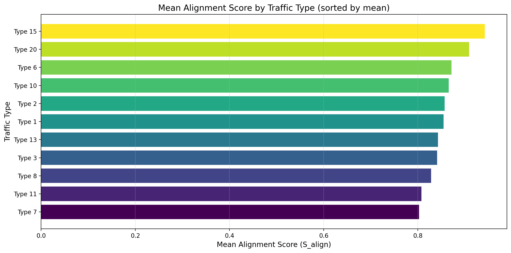{fig-cap="Mean alignment score by traffic type" fig-align="center" width=90%}

## Feature Monotonicity

Verify that alignment behaves monotonically with intuitive intent-related features.

```{python}
#| eval: true
#| code-fold: true
#| code-summary: "Show code for loading data and binning features"

import pandas as pd
import numpy as np
import matplotlib.pyplot as plt
from pathlib import Path

# Load alignment metrics
try:
    results_df = pd.read_parquet('data/processed/alignment_metrics.parquet')
except Exception:
    results_df = pd.read_csv('data/processed/alignment_metrics.csv')

# Load original dataset and get feature columns
df_original = pd.read_csv('data/online_shoppers_intention.csv')
n_val = len(results_df)
features_to_check = ['PageValues', 'BounceRates', 'ExitRates', 'ProductRelated', 'ProductRelated_Duration']
df_features = df_original.iloc[-n_val:][features_to_check].reset_index(drop=True)
df_combined = pd.concat([results_df.reset_index(drop=True), df_features], axis=1)

# Check which features exist
features_available = [f for f in features_to_check if f in df_combined.columns]
features_missing = [f for f in features_to_check if f not in df_combined.columns]

if features_missing:
    print(f"Note: Features not found: {features_missing}")

print(f"Analyzing {len(features_available)} features: {features_available}")

# Create output directory
outdir = Path("assets/figures")
outdir.mkdir(parents=True, exist_ok=True)

# Prepare binned summaries for each feature
n_bins = 5
feature_summaries = {}

for feature in features_available:
    df_feat = df_combined[[feature, 'S_align']].dropna()
    
    if len(df_feat) < n_bins:
        print(f"Warning: Not enough values for {feature}, skipping")
        continue
    
    try:
        df_feat['bin'] = pd.qcut(df_feat[feature], q=n_bins, duplicates='drop', labels=False)
        bin_summary = df_feat.groupby('bin')['S_align'].agg(['mean', 'median', 'count']).reset_index()
        bin_summary = bin_summary.sort_values('bin')
        feature_summaries[feature] = bin_summary
        print(f"\n{feature} binned summary:")
        print(bin_summary)
    except ValueError:
        print(f"Warning: Could not create quantile bins for {feature}, skipping")
```

```{python}
#| eval: true

# Plot each feature
for feature, bin_summary in feature_summaries.items():
    plt.figure(figsize=(10, 6))
    plt.plot(bin_summary['bin'], bin_summary['mean'], marker='o', markersize=10, linewidth=2)
    plt.xlabel(f'{feature} Bin (quantile)', fontsize=12)
    plt.ylabel('Mean Alignment Score (S_align)', fontsize=12)
    plt.title(f'Mean Alignment Score by {feature} Quantiles', fontsize=14)
    plt.xticks(bin_summary['bin'], [f'Q{i+1}' for i in range(len(bin_summary))])
    plt.grid(True, alpha=0.3)
    plt.tight_layout()
    
    # Save figure
    outfile = outdir / f"fig-pillar4-{feature.lower()}.png"
    plt.savefig(outfile, dpi=200, bbox_inches="tight")
    plt.close()
    print(f"Saved figure: {outfile}")
```

The following figures show alignment score monotonicity across feature quantiles:

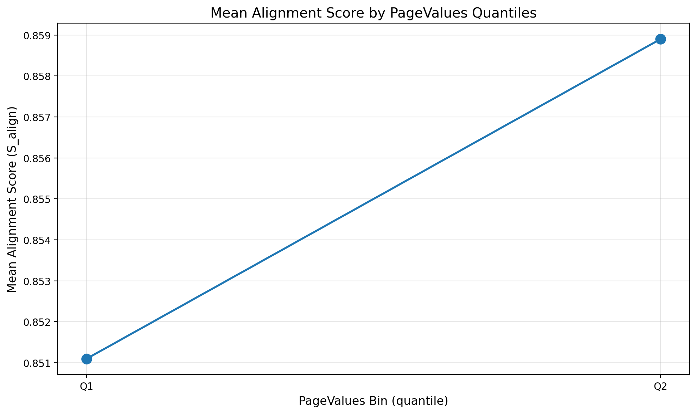{fig-cap="Mean alignment score by PageValues quantiles" fig-align="center" width=90%}

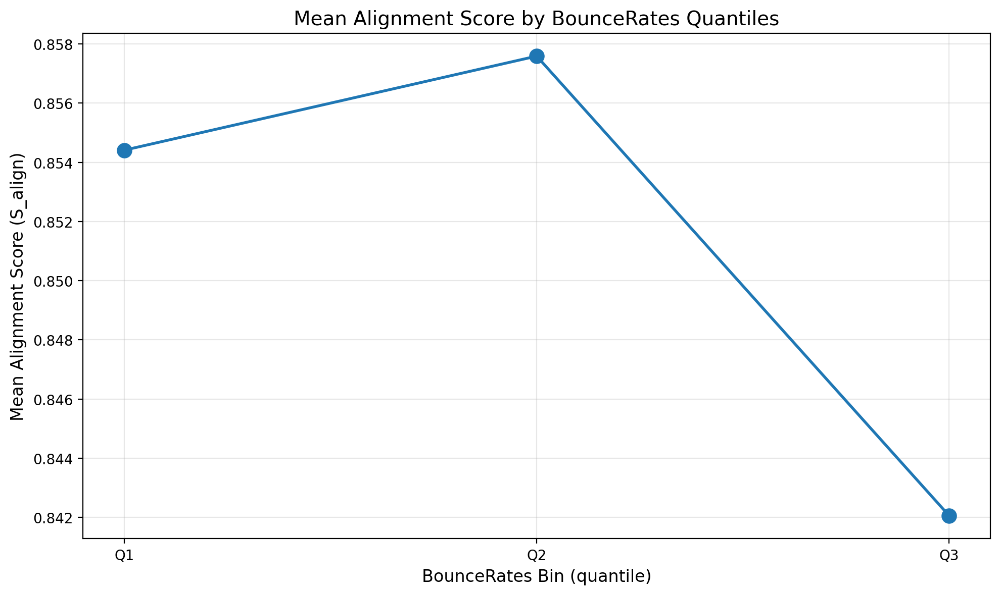{fig-cap="Mean alignment score by BounceRates quantiles" fig-align="center" width=90%}

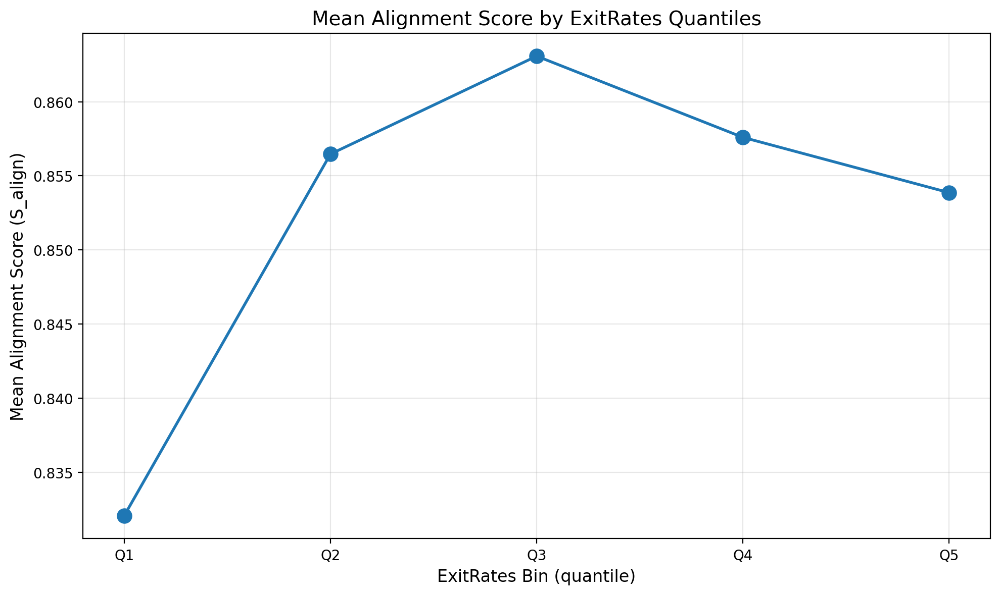{fig-cap="Mean alignment score by ExitRates quantiles" fig-align="center" width=90%}

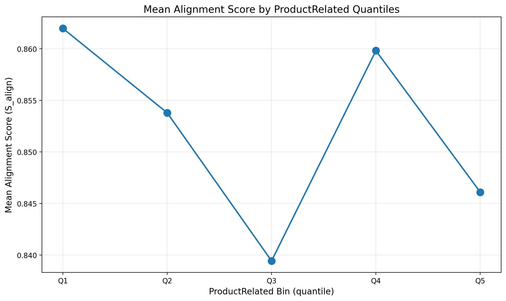{fig-cap="Mean alignment score by ProductRelated quantiles" fig-align="center" width=90%}

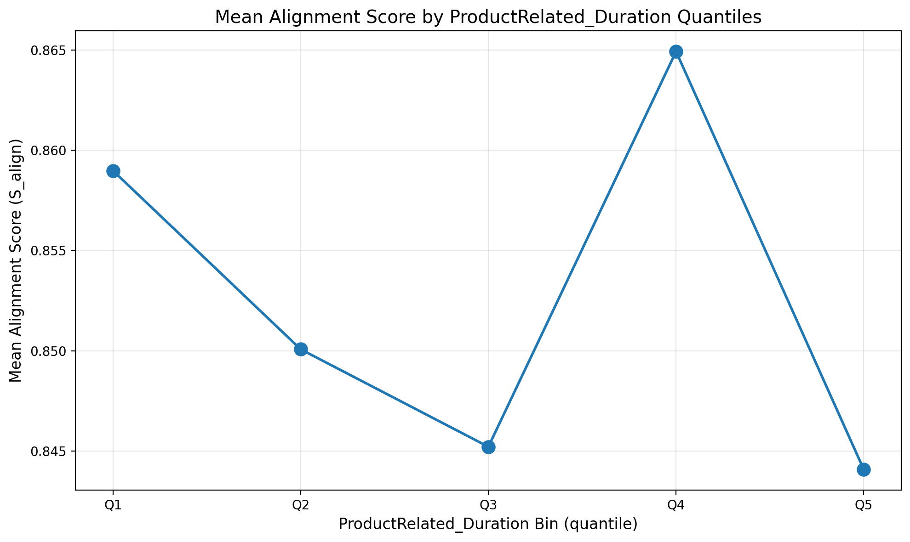{fig-cap="Mean alignment score by ProductRelated_Duration quantiles" fig-align="center" width=90%}

## Calibration Check

Check whether alignment decreases when high-confidence utility predictions are contradicted by observed behavior.

```{python}
#| eval: true
#| code-fold: true
#| code-summary: "Show code for loading data and computing calibration metrics"

import pandas as pd
import numpy as np
import matplotlib.pyplot as plt
import pickle
from pathlib import Path

# Load alignment metrics
try:
    results_df = pd.read_parquet('data/processed/alignment_metrics.parquet')
except Exception:
    results_df = pd.read_csv('data/processed/alignment_metrics.csv')

# Load rationality parameter
with open('data/processed/rationality_temperature.pkl', 'rb') as f:
    lambda_hat = pickle.load(f)['lambda_hat']

V = results_df['V'].values
y_val = results_df['Revenue'].values

print(f"λ̂ (rationality parameter): {lambda_hat:.6f}")

# Compute predicted purchase probability: p = sigmoid(lambda_hat * V)
z = np.clip(lambda_hat * V, -500, 500)  # Clip to avoid overflow
p_pred = 1.0 / (1.0 + np.exp(-z))

print(f"\nPredicted probabilities:")
print(f"  Range: [{p_pred.min():.6f}, {p_pred.max():.6f}]")
print(f"  Mean: {p_pred.mean():.6f}")

# Bin into confidence bins and compute summaries
results_df['p_pred'] = p_pred
results_df['bin'] = pd.cut(p_pred, bins=10, labels=False, include_lowest=True)

calibration_df = results_df.groupby('bin').agg({
    'p_pred': 'mean',
    'Revenue': 'mean',  # Observed purchase rate
    'S_align': 'mean',
    'V': 'count'  # Sample count
}).reset_index()
calibration_df.columns = ['bin', 'mean_predicted_prob', 'observed_purchase_rate', 'mean_s_align', 'n_samples']
calibration_df = calibration_df.sort_values('mean_predicted_prob')

print("\nCalibration Table:")
print(calibration_df.to_string(index=False))

# Create output directory
outdir = Path("assets/figures")
outdir.mkdir(parents=True, exist_ok=True)
```

```{python}
#| eval: true

# Plot 1: Predicted vs Observed purchase rate
plt.figure(figsize=(10, 6))
plt.plot(calibration_df['mean_predicted_prob'], calibration_df['observed_purchase_rate'], 
         marker='o', markersize=10, linewidth=2, label='Observed rate')
plt.plot([0, 1], [0, 1], 'r--', linewidth=2, label='Perfect calibration', alpha=0.7)
plt.xlabel('Mean Predicted Probability per Bin', fontsize=12)
plt.ylabel('Observed Purchase Rate', fontsize=12)
plt.title('Calibration Check: Predicted vs Observed Purchase Rate', fontsize=14)
plt.xlim([0, 1])
plt.ylim([0, 1])
plt.grid(True, alpha=0.3)
plt.legend()
plt.tight_layout()

# Save figure
outfile = outdir / "fig-pillar5-calibration.png"
plt.savefig(outfile, dpi=200, bbox_inches="tight")
plt.close()
print("Saved figure:", outfile)
```

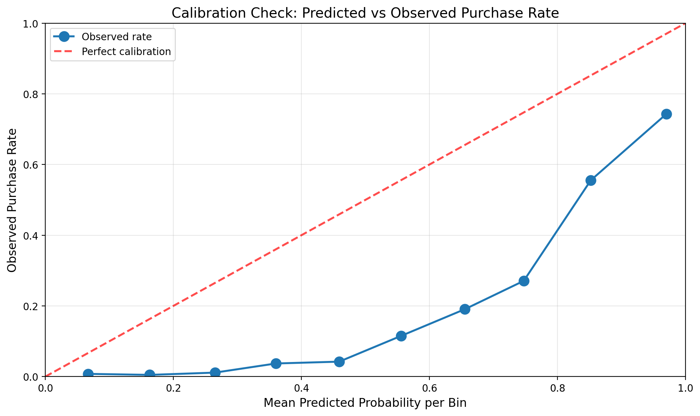{fig-cap="Calibration check: predicted vs observed purchase rate" fig-align="center" width=90%}

```{python}
#| eval: true

# Plot 2: Alignment score vs predicted probability
plt.figure(figsize=(10, 6))
plt.plot(calibration_df['mean_predicted_prob'], calibration_df['mean_s_align'], 
         marker='o', markersize=10, linewidth=2, color='green')
plt.xlabel('Mean Predicted Probability per Bin', fontsize=12)
plt.ylabel('Mean Alignment Score (S_align)', fontsize=12)
plt.title('Alignment Score vs Predicted Probability', fontsize=14)
plt.xlim([0, 1])
plt.grid(True, alpha=0.3)
plt.tight_layout()

# Save figure
outfile = outdir / "fig-pillar5-alignment-vs-prob.png"
plt.savefig(outfile, dpi=200, bbox_inches="tight")
plt.close()
print("Saved figure:", outfile)
```

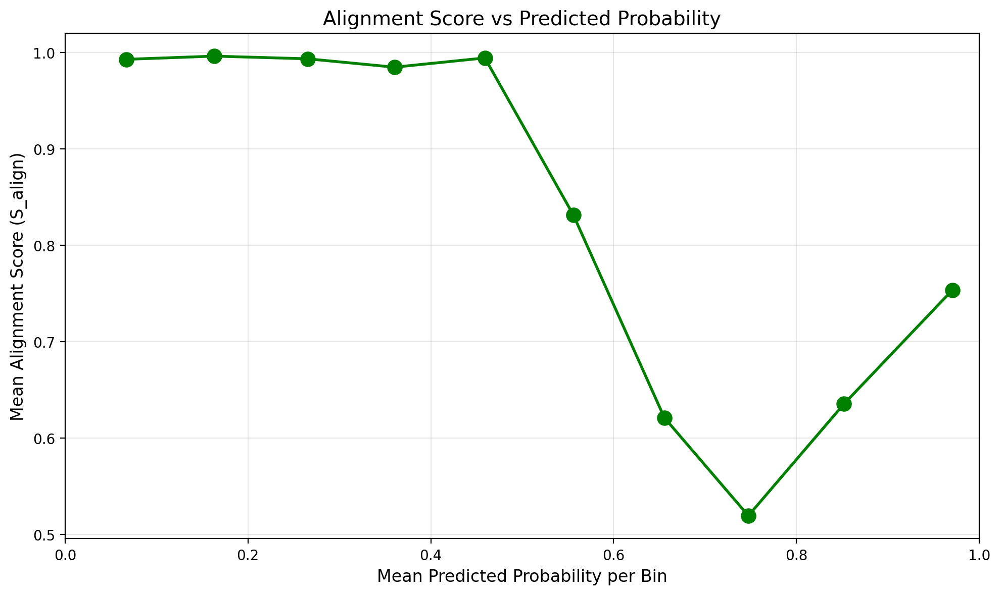{fig-cap="Alignment score vs predicted probability" fig-align="center" width=90%}
