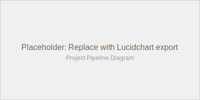

# Overview

## Abstract

This project investigates value alignment in online shopping behavior by inferring latent shopper preferences from session-level data and quantifying how consistently actions align with those preferences, especially under contextual shifts. We employ a Bayesian framework using Hamiltonian Monte Carlo (HMC) with the No-U-Turn Sampler (NUTS) to estimate preference parameters, and develop a rationality-based alignment metric that captures the consistency between observed behavior and inferred preferences. The analysis focuses on understanding how contextual factors such as weekend shopping, special days, and traffic sources affect preference stability and decision-making rationality.

## Project Pipeline

```{=html}
<div style="text-align: center;">
  
</div>
```

## Key Contributions

- **Bayesian Preference Inference**: Hierarchical Bayesian model using HMC/NUTS for robust posterior estimation of shopper preferences
- **Rationality Parameter Estimation**: Post-hoc temperature scaling via Newton's method to estimate rationality parameter λ
- **Context-Aware Alignment Metrics**: Quantification of preference stability under contextual shifts (weekend/holiday effects)
- **Compositional Data Analysis**: Application of additive log-ratio (ALR) transforms for time-share modeling

## Repository Map

### Code Organization

- **`notebooks/`**: Full analysis notebooks
  - `01_eda.ipynb`: Exploratory data analysis
  - `02_transforms.ipynb`: Feature engineering and preprocessing
  - `03_hmc.ipynb`: Bayesian modeling with PyMC
  - `04_alignment.ipynb`: Rationality estimation and alignment scores

- **`src/`**: Python modules
  - `data.py`: Data loading and validation
  - `transforms.py`: Feature transformations
  - `model.py`: PyMC model definitions
  - `alignment.py`: Rationality and alignment computations
  - `evaluation.py`: Evaluation metrics and robustness checks

### Assets

- **`assets/figures/`**: Final figures for publication
- **`assets/diagrams/`**: Lucidchart exports (SVG preferred)

## Status

**Active Research**: This project is currently in active development. Model estimation and rationality parameter optimization are complete. Ongoing work includes finalizing alignment score computation, context shift evaluation, and robustness analysis.

