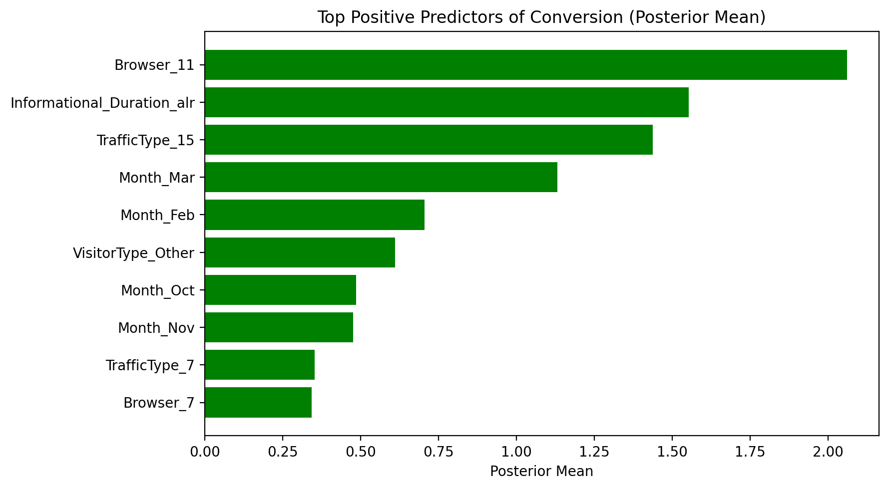
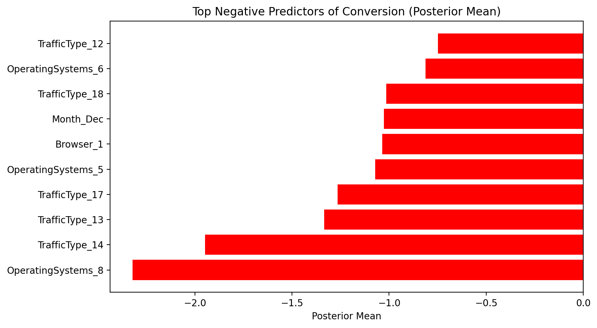
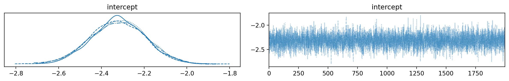
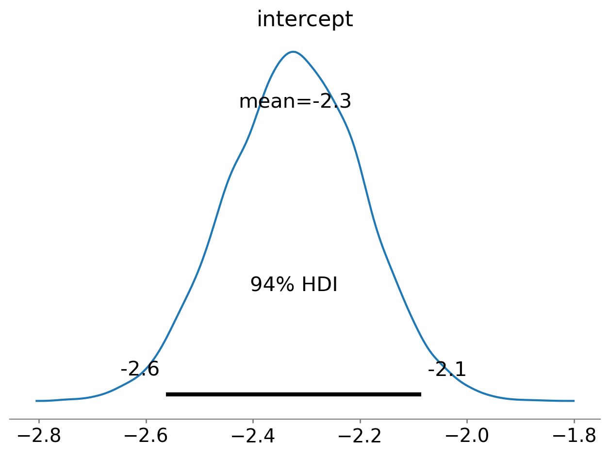

# Modeling Framework: HMC / NUTS

## Modeling Assumptions

1. **Stable Latent Preferences**: Shoppers have underlying preferences \(\boldsymbol{\theta}\) that map context and page-type features to utility of allocating time/attention
2. **Quantal (Noisy) Rationality**: Actions maximize expected utility subject to stochasticity; inverse temperature \(\lambda\) captures rationality/consistency
3. **Context Shifts**: Contextual factors perturb constraints/utilities but do not fundamentally change stable preferences

## Motivation to use HMC using a Bayesian approach

### Continuing from Logistic Regression

**Step 1 — Log-odds assumption**

$$
\log\left(\frac{p(\mathbf{x})}{1-p(\mathbf{x})}\right) = \mathbf{w}^\top \mathbf{x} + b
$$

We assume the log-odds of purchase are a linear function of observed features.

This is a modeling assumption that defines a latent linear utility structure.

↓

**Step 2 — Probability via sigmoid**

$$
p(\mathbf{x}) = \sigma(\mathbf{w}^\top \mathbf{x} + b)
$$

The sigmoid function converts linear utility into a valid probability in $(0,1)$.

This yields a probabilistic interpretation of the binary outcome.

↓

**Step 3 — Parameter uncertainty**

$$
P(\boldsymbol{\theta}) = P(\boldsymbol{\theta} = \boldsymbol{\beta})
$$

Model parameters are treated as random variables rather than fixed values.

A prior distribution encodes uncertainty or beliefs before observing data.

↓

**Step 4 — Bayesian posterior**

$$
P(\boldsymbol{\theta} \mid \mathbf{x}, \mathbf{y}) \propto P(\mathbf{y} \mid \mathbf{x}, \boldsymbol{\theta}) \, P(\boldsymbol{\theta})
$$

Observed data updates prior beliefs through Bayes' rule.

The posterior captures uncertainty over parameters after seeing $(\mathbf{x}, \mathbf{y})$.

↓

**Step 5 — Normalizing constant**

$$
P(\mathbf{y} \mid \mathbf{x}) = \int P(\mathbf{y} \mid \mathbf{x}, \boldsymbol{\theta}) \, P(\boldsymbol{\theta}) \, d\boldsymbol{\theta}
$$

This integral is required to normalize the posterior distribution.

It marginalizes over all possible parameter values.

↓

**Step 6 — Intractability**

- $P(\mathbf{y} \mid \mathbf{x}, \boldsymbol{\theta})$ does not follow a known closed-form distribution
- The integral is high-dimensional (e.g. many features / parameters)

As a result, $P(\mathbf{y} \mid \mathbf{x})$ cannot be computed analytically using standard methods.

**Key conclusion**

Bayesian inference is well-defined but not tractable in closed form, motivating Monte Carlo methods (e.g., HMC / NUTS).

## HMC sampling method

### Hamiltonian Monte Carlo (HMC) Sampling Chain

**Step 1 — Target posterior**

$$
P(\boldsymbol{\theta} \mid \mathbf{x}, \mathbf{y}) \propto P(\mathbf{y} \mid \mathbf{x}, \boldsymbol{\theta}) \, P(\boldsymbol{\theta})
$$

This posterior is the distribution of interest but is not available in closed form.

HMC constructs a Markov chain whose stationary distribution is $P(\boldsymbol{\theta} \mid \mathbf{x}, \mathbf{y})$.

↓

**Step 2 — Markov chain objective**

$$
\boldsymbol{\theta}^{(0)} \to \boldsymbol{\theta}^{(1)} \to \boldsymbol{\theta}^{(2)} \to \cdots
$$

Each sample depends only on the previous state, defining a Markov process.

The chain is designed so its stationary distribution equals the posterior.

↓

**Step 3 — Augment with momentum**

$$
\mathbf{p} \sim \mathcal{N}(\mathbf{0}, \mathbf{M})
$$

Auxiliary momentum variables are introduced to expand the state space.

This allows sampling to be modeled as a physical dynamical system.

↓

**Step 4 — Hamiltonian system**

$$
H(\boldsymbol{\theta}, \mathbf{p}) = -\log P(\boldsymbol{\theta} \mid \mathbf{x}, \mathbf{y}) + \frac{1}{2} \mathbf{p}^\top \mathbf{M}^{-1} \mathbf{p}
$$

The posterior defines a potential energy landscape.

Gradients of $\log P(\boldsymbol{\theta} \mid \mathbf{x}, \mathbf{y})$ act as forces that push trajectories toward higher-probability regions.

↓

**Step 5 — Gradient-guided exploration**

$$
\frac{d\boldsymbol{\theta}}{dt} = \frac{\partial H}{\partial \mathbf{p}}, \quad \frac{d\mathbf{p}}{dt} = -\frac{\partial H}{\partial \boldsymbol{\theta}}
$$

Hamiltonian dynamics move samples smoothly through parameter space.

Derivatives guide exploration efficiently without random-walk behavior.

↓

**Step 6 — Stationary sampling**

$$
\{\boldsymbol{\theta}^{(s)}\}_{s=1}^S \sim P(\boldsymbol{\theta} \mid \mathbf{x}, \mathbf{y})
$$

After convergence, the Markov chain produces samples from the posterior.

Monte Carlo averages approximate expectations and quantify uncertainty.

## Why HMC / NUTS?

- **Efficiency**: NUTS adaptively determines optimal trajectory length, reducing the need for manual tuning
- **Robustness**: Better exploration of complex, high-dimensional posteriors compared to random-walk Metropolis
- **Gradient Information**: Uses gradient information to propose high-probability moves, reducing autocorrelation

## HMC/NUTS evaluation

### Top Predictors Visualization

The following visualizations examine the posterior distributions of model parameters to identify the most influential features for conversion prediction.

#### Top Positive Predictors

This horizontal bar chart displays the ten features with the strongest positive association with conversion, based on their posterior mean coefficients. Features are ranked by the magnitude of their positive effect on the probability of purchase.

```{python}
#| eval: true
#| code-fold: true
#| fig-cap: "Top Positive Predictors of Conversion (Posterior Mean)"
#| fig-align: center
#| label: fig-top-positive-predictors

from pathlib import Path
import pandas as pd
import numpy as np
import matplotlib.pyplot as plt
import pickle
import arviz as az

# Create output directory
outdir = Path("assets/figures")
outdir.mkdir(parents=True, exist_ok=True)

# Load trace and data from processed files
with open('data/processed/pymc_trace.pkl', 'rb') as f:
    trace = pickle.load(f)

with open('data/processed/feature_names.pkl', 'rb') as f:
    feature_names = pickle.load(f)

# Generate summary statistics
summary = az.summary(trace, var_names=["beta", "intercept"])
summary["feature"] = ["intercept"] + list(feature_names)

# Visualize top positive and negative predictors
summary_beta = summary.loc[summary["feature"] != "intercept"]
summary_sorted = summary_beta.sort_values("mean")

top_pos = summary_sorted.tail(10)

fig, ax = plt.subplots(figsize=(9, 5))
ax.barh(top_pos["feature"], top_pos["mean"], color="green")
ax.set_title("Top Positive Predictors of Conversion (Posterior Mean)")
ax.set_xlabel("Posterior Mean")
plt.tight_layout()

# Save figure
outfile = outdir / "fig-top-positive-predictors.png"
fig.savefig(outfile, dpi=200, bbox_inches="tight")
plt.close(fig)
print("Saved figure:", outfile)
```

{fig-cap="Top Positive Predictors of Conversion (Posterior Mean)" fig-align="center" width=90%}

The chart reveals that `Browser_11` has the strongest positive predictive effect (posterior mean ≈ 2.05), followed by `Informational_Duration_alr` (posterior mean ≈ 1.55), which demonstrates the value of compositional data analysis techniques applied during preprocessing.

#### Top Negative Predictors

This chart identifies features associated with a lower likelihood of conversion, ranked by the magnitude of their negative posterior mean coefficients.

```{python}
#| eval: true
#| code-fold: true
#| fig-cap: "Top Negative Predictors of Conversion (Posterior Mean)"
#| fig-align: center
#| label: fig-top-negative-predictors

from pathlib import Path
import pandas as pd
import numpy as np
import matplotlib.pyplot as plt
import pickle
import arviz as az

# Create output directory
outdir = Path("assets/figures")
outdir.mkdir(parents=True, exist_ok=True)

# Load trace and data from processed files (reload to ensure availability)
with open('data/processed/pymc_trace.pkl', 'rb') as f:
    trace = pickle.load(f)

with open('data/processed/feature_names.pkl', 'rb') as f:
    feature_names = pickle.load(f)

# Generate summary statistics
summary = az.summary(trace, var_names=["beta", "intercept"])
summary["feature"] = ["intercept"] + list(feature_names)

# Visualize top negative predictors
summary_beta = summary.loc[summary["feature"] != "intercept"]
summary_sorted = summary_beta.sort_values("mean")

top_neg = summary_sorted.head(10)

fig, ax = plt.subplots(figsize=(9, 5))
ax.barh(top_neg["feature"], top_neg["mean"], color="red")
ax.set_title("Top Negative Predictors of Conversion (Posterior Mean)")
ax.set_xlabel("Posterior Mean")
plt.tight_layout()

# Save figure
outfile = outdir / "fig-top-negative-predictors.png"
fig.savefig(outfile, dpi=200, bbox_inches="tight")
plt.close(fig)
print("Saved figure:", outfile)
```

{fig-cap="Top Negative Predictors of Conversion (Posterior Mean)" fig-align="center" width=90%}

`OperatingSystems_8` shows the strongest negative association (posterior mean ≈ -2.0), indicating users with this operating system are significantly less likely to convert.

### Convergence Diagnostics

#### Trace Plot and Posterior Density for Intercept

Trace plots visualize the sampled values across MCMC iterations for each chain, allowing assessment of convergence and mixing. The left subplot shows the posterior density estimate (KDE), while the right subplot displays the trace across iterations.

```{python}
#| eval: true
#| code-fold: true
#| fig-cap: "Trace plot and posterior density for intercept parameter"
#| fig-align: center
#| label: fig-intercept-trace

from pathlib import Path
import matplotlib.pyplot as plt
import pickle
import arviz as az
import numpy as np

# Create output directory
outdir = Path("assets/figures")
outdir.mkdir(parents=True, exist_ok=True)

# Load trace if not already loaded
if 'trace' not in locals():
    with open('data/processed/pymc_trace.pkl', 'rb') as f:
        trace = pickle.load(f)

# Plot trace for intercept
axes = az.plot_trace(trace, var_names=["intercept"])
plt.tight_layout()

# ArviZ returns axes, get the figure from the current figure
fig = plt.gcf()

# Save figure
outfile = outdir / "fig-intercept-trace.png"
fig.savefig(outfile, dpi=200, bbox_inches="tight")
plt.close(fig)
print("Saved figure:", outfile)
```

{fig-cap="Trace plot and posterior density for intercept parameter" fig-align="center" width=90%}

The overlapping density curves and "fuzzy caterpillar" appearance of the trace plot indicate good convergence and mixing across all chains. The intercept is centered around -2.3 to -2.4, representing the baseline log-odds of conversion.

#### Posterior Distribution with Highest Density Interval (HDI)

The posterior distribution plot shows the full probability distribution of the intercept parameter, annotated with the mean and 94% Highest Density Interval (HDI).

```{python}
#| eval: true
#| code-fold: true
#| fig-cap: "Posterior distribution of intercept with 94% HDI"
#| fig-align: center
#| label: fig-intercept-posterior

from pathlib import Path
import matplotlib.pyplot as plt
import pickle
import arviz as az
import numpy as np

# Create output directory
outdir = Path("assets/figures")
outdir.mkdir(parents=True, exist_ok=True)

# Load trace if not already loaded
if 'trace' not in locals():
    with open('data/processed/pymc_trace.pkl', 'rb') as f:
        trace = pickle.load(f)

# Posterior distribution for intercept
axes = az.plot_posterior(trace, var_names=["intercept"])
plt.tight_layout()

# ArviZ returns axes, get the figure from the current figure
fig = plt.gcf()

# Save figure
outfile = outdir / "fig-intercept-posterior.png"
fig.savefig(outfile, dpi=200, bbox_inches="tight")
plt.close(fig)
print("Saved figure:", outfile)
```

{fig-cap="Posterior distribution of intercept with 94% HDI" fig-align="center" width=90%}

The 94% HDI (approximately -2.6 to -2.1) represents the most credible range of intercept values, containing 94% of the posterior probability mass. This provides a Bayesian credible interval for the baseline conversion probability.

## Generative Model

```{=html}
<div style="text-align: center;">
  
</div>
```

## Figures

The following figures are generated from the HMC/NUTS evaluation:

1. **Figure: Top Positive Predictors** (`fig-top-positive-predictors.png`)
   - Bar chart showing the top 10 features with the strongest positive association with conversion
   - Located in: `assets/figures/fig-top-positive-predictors.png`

2. **Figure: Top Negative Predictors** (`fig-top-negative-predictors.png`)
   - Bar chart showing the top 10 features with the strongest negative association with conversion
   - Located in: `assets/figures/fig-top-negative-predictors.png`

3. **Figure: Intercept Trace Plot** (`fig-intercept-trace.png`)
   - Trace plot and posterior density for the intercept parameter
   - Shows convergence diagnostics across MCMC chains
   - Located in: `assets/figures/fig-intercept-trace.png`

4. **Figure: Intercept Posterior Distribution** (`fig-intercept-posterior.png`)
   - Posterior distribution of intercept with 94% Highest Density Interval (HDI)
   - Located in: `assets/figures/fig-intercept-posterior.png`

## Code References

- **HMC Notebook**: [`Writeups/notebooks/03_hmc.ipynb`](/Writeups/notebooks/03_hmc.ipynb)
- **Model Module**: [`/src/model.py`](/src/model.py)
