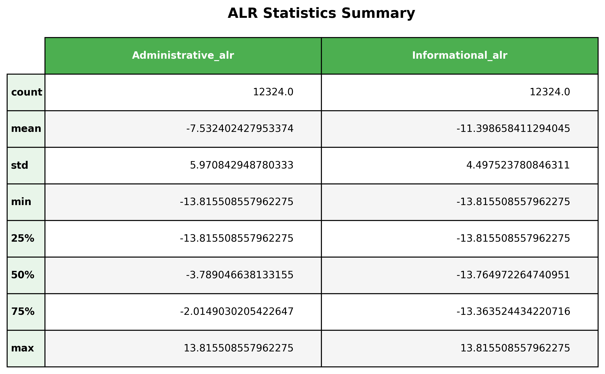

# Transforms & Preprocessing

## Preprocessing Overview

The preprocessing pipeline transforms raw session-level features into a format suitable for Bayesian modeling. Key steps include handling missing values, encoding categorical variables, and applying appropriate scaling for numerical features.

## Feature Encoding

### Categorical Variables

- **One-Hot Encoding**: Applied to nominal categorical variables (`Month`, `VisitorType`, `OperatingSystems`, `Browser`, `Region`, `TrafficType`). The mode (most frequent category) in each variable is dropped and used as the reference category.
- **Binary Encoding**: `Weekend` and `Revenue` are converted to binary indicators.

**Binary to Integer Conversion**

```{python}
#| echo: true
#| code-fold: true
#| code-summary: "Show code"

# For all columns in df_alr, if the datatype is bool, convert to int
bool_cols = df_alr.select_dtypes(include=["bool"]).columns
df_alr[bool_cols] = df_alr[bool_cols].astype(int)
```

*Code reference: See [`Writeups/notebooks/02_transforms.ipynb`](Writeups/notebooks/02_transforms.ipynb) (Cell 9)*

**One-Hot Encoding**

```{python}
#| echo: true
#| code-fold: true
#| code-summary: "Show code"

# One-hot encode VisitorType 
df_alr = pd.get_dummies(df_alr, columns=['VisitorType'])

# One-hot encode Month
df_alr = pd.get_dummies(df_alr, columns=['Month'])

# One-hot encode Browser
df_alr = pd.get_dummies(df_alr, columns=['Browser'])

# One-hot encode Region
df_alr = pd.get_dummies(df_alr, columns=['Region'])

# One-hot encode TrafficType
df_alr = pd.get_dummies(df_alr, columns=['TrafficType'])

# One-hot encode OS
df_alr = pd.get_dummies(df_alr, columns=['OperatingSystems'])

df_alr
```

*Code reference: See [`Writeups/notebooks/02_transforms.ipynb`](Writeups/notebooks/02_transforms.ipynb) (Cell 10)*

**Dropping Reference Categories**

```{python}
#| echo: true
#| code-fold: true
#| code-summary: "Show code"

def drop_highest_freq_reference(df: pd.DataFrame, groups: list):
    """
    For each categorical group already OHE'd, drop the dummy column
    corresponding to the highest-frequency category (reference).
    
    Args:
        df (pd.DataFrame): Input dataframe with OHE columns
        groups (list): List of base names for categorical groups
    
    Returns:
        pd.DataFrame: Dataframe with reference columns dropped
        dict: Mapping of group -> dropped reference category
    """
    dropped_refs = {}

    for group in groups:
       
        group_cols = [c for c in df.columns if c.startswith(group + "_")]
        if not group_cols:
            continue

        
        ref_col = df[group_cols].sum().idxmax()
        dropped_refs[group] = ref_col

       
        df = df.drop(columns=[ref_col])

    return df, dropped_refs

# Example usage:
groups = ["Browser", "OperatingSystems", "Region", "VisitorType", "Month", "TrafficType"]
df_new, refs = drop_highest_freq_reference(df_alr, groups)
print("Reference categories dropped:", refs)
```

*Code reference: See [`Writeups/notebooks/02_transforms.ipynb`](Writeups/notebooks/02_transforms.ipynb) (Cell 11)*

### Numerical Features

- **Standard Scaling**: Applied to continuous, unbounded features (such as durations, page values) using `StandardScaler` from scikit-learn.

```{python}
#| echo: true
#| code-fold: true
#| code-summary: "Show code"

import pandas as pd
from sklearn.preprocessing import StandardScaler

# Load data
df = pd.read_csv('data/online_shoppers_intention.csv')

# Normalize bounce rates using standard scaler
scaler = StandardScaler()
df['BounceRates'] = scaler.fit_transform(df[['BounceRates']])
```

*Code reference: See [`Writeups/notebooks/02_transforms.ipynb`](Writeups/notebooks/02_transforms.ipynb) (Cell 3)*

**Closure Operation for Compositional Features**

The closure operation normalizes compositional features (counts and durations) to sum to 1, converting them to proportions or time-shares:

```{python}
#| echo: true
#| code-fold: true
#| code-summary: "Show code"

import pandas as pd

# Load data
df = pd.read_csv('data/online_shoppers_intention.csv')

count_cols = ["Administrative", "Informational", "ProductRelated"]
duration_cols = ["Administrative_Duration", "Informational_Duration", "ProductRelated_Duration"]

def closure(df, cols):
    subset = df[cols]
    sums = subset.sum(axis=1)
    closed = subset.div(sums.replace(0, pd.NA), axis=0)
    return closed

# Apply closure
df_counts_closed = closure(df, count_cols).add_suffix("_closed")
df_durs_closed   = closure(df, duration_cols).add_suffix("_closed")

# Append back to main dataframe
df_closure = pd.concat([df, df_counts_closed, df_durs_closed], axis=1)

df_closure.head()
```

*Code reference: See [`Writeups/notebooks/02_transforms.ipynb`](Writeups/notebooks/02_transforms.ipynb) (Cell 4)*

### Compositional Features

Certain groups of features, namely the session-level **counts** (`Administrative`, `Informational`, `ProductRelated`) and corresponding **durations** (`Administrative_Duration`, `Informational_Duration`, `ProductRelated_Duration`), represent compositions. These are constrained to sum to a total across categories, meaning they reside on a *simplex* rather than in standard Euclidean space.

To apply classical machine learning or regression methods, these compositional features must be transformed from the simplex to Euclidean space. This is typically done using log-ratio transforms (such as the additive log-ratio (ALR) or centered log-ratio (CLR)), which appropriately map these features for downstream modeling.


## Scaling & Normalization

All continuous features are standardized to have zero mean and unit variance:

$$
z_i = \frac{x_i - \mu}{\sigma}
$$

where $x_i$ is the original value, $\mu$ is the mean, $\sigma$ is the standard deviation, and $z_i$ is the standardized value. This ensures numerical stability in the Bayesian inference procedure and allows for meaningful prior specification.

## Compositional Data Analysis (CoDA)

Let

$$
s = (s_{\textrm{Adm}},\, s_{\textrm{Info}},\, s_{\textrm{Prod}}) \in S_2,
\quad S_2 = \left\{ s \in \mathbb{R}_{>0}^3 : s_{\textrm{Adm}} + s_{\textrm{Info}} + s_{\textrm{Prod}} = 1 \right\}
$$

where $s_j$ denotes the time-share spent in page category $j$. To map the simplex to an unconstrained Euclidean space, we use the **additive log-ratio (ALR) transform** with ProductRelated as the reference part:

$$
\eta_1 = \log\left(\frac{s_{\textrm{Adm}}}{s_{\textrm{Prod}}}\right),\qquad
\eta_2 = \log\left(\frac{s_{\textrm{Info}}}{s_{\textrm{Prod}}}\right)
$$

This is a bijection on the interior of the simplex, with inverse:

$$
s_{\textrm{Prod}} = \frac{1}{1 + e^{\eta_1} + e^{\eta_2}},\qquad
s_{\textrm{Adm}} = e^{\eta_1} \cdot s_{\textrm{Prod}},\qquad
s_{\textrm{Info}} = e^{\eta_2} \cdot s_{\textrm{Prod}}
$$

Working in $\mathbb{R}^2$ avoids the unit-sum constraint and supports standard regression while preserving relative information encoded in ratios.

**ALR Transform Implementation**

The following code implements the ALR transform with zero-handling via multiplicative replacement:

```{python}
#| echo: true
#| code-fold: true
#| code-summary: "Show code"

import pandas as pd
import numpy as np

# Load data (assuming df_closure already exists from previous steps)
# This would typically be done after closure operation
df = pd.read_csv('data/online_shoppers_intention.csv')

count_cols = ["Administrative", "Informational", "ProductRelated"]
duration_cols = ["Administrative_Duration", "Informational_Duration", "ProductRelated_Duration"]

# Closure function (assuming already defined)
def closure(df, cols):
    subset = df[cols]
    sums = subset.sum(axis=1)
    closed = subset.div(sums.replace(0, pd.NA), axis=0)
    return closed

# Multiplicative replacement function
def multiplicative_replace_closed(row, cols, delta=1e-6):
    """
    Multiplicative replacement for zeros in a closed compositional vector.
    """
    x = row[cols].to_numpy(dtype=float)
    D = len(x)
    zeros = (x == 0)
    z = zeros.sum()
    if z == 0:
        x = x / x.sum()
        return x
    x[zeros] = delta
    mass_added = delta * z
    nonzero_idx = ~zeros
    nz_mass = x[nonzero_idx].sum()
    if nz_mass <= 0:
        return np.ones(D) / D
    x[nonzero_idx] = x[nonzero_idx] * (1 - mass_added / nz_mass)
    x = x / x.sum()
    return x

# Apply closure first (assuming this was done earlier)
df_counts_closed = closure(df, count_cols).add_suffix("_closed")
df_durs_closed = closure(df, duration_cols).add_suffix("_closed")
df_closure = pd.concat([df, df_counts_closed, df_durs_closed], axis=1)
df_closure = df_closure.dropna(subset=df_closure.columns[df_closure.columns.str.endswith("_closed")])

def alr_transform(df, closed_cols, reference_idx=2):
    """
    Apply additive log-ratio (ALR) transform to closed compositional data.
    
    Parameters:
    df: DataFrame with closed compositional columns
    closed_cols: list of closed column names
    reference_idx: index of reference part (default 2 = ProductRelated)
    
    Returns:
    DataFrame with ALR transformed columns only
    """
    closed_df = df[closed_cols].copy()
    reference_col = closed_cols[reference_idx]
    
    # Detect rows with zeros ANYWHERE in the compositional vector
    rows_with_zeros = (closed_df[closed_cols] == 0).any(axis=1)
    
    # Apply multiplicative replacement ONLY to rows that contain zeros
    if rows_with_zeros.any():
        for idx in closed_df[rows_with_zeros].index:
            row = closed_df.loc[idx]
            replaced = multiplicative_replace_closed(row, closed_cols)
            closed_df.loc[idx] = replaced
            
            # Verify positivity and closure for replaced rows
            assert (replaced > 0).all(), f"Row {idx}: replacement resulted in non-positive values"
            assert np.isclose(replaced.sum(), 1.0, rtol=1e-10), f"Row {idx}: replacement not closed (sum={replaced.sum()})"
    
    # Compute ALR transform: log(s_i / s_ref) for all i != ref
    alr_cols = []
    for i, col in enumerate(closed_cols):
        if i != reference_idx:
            alr_col = col.replace('_closed', '_alr')
            closed_df[alr_col] = np.log(closed_df[col] / closed_df[reference_col])
            alr_cols.append(alr_col)
    
    # Return ONLY the ALR columns
    result = closed_df[alr_cols].copy()
    
    # Safety check: ensure all ALR values are finite
    if not np.isfinite(result.values).all():
        invalid_mask = ~np.isfinite(result.values)
        invalid_rows = np.where(invalid_mask.any(axis=1))[0]
        raise ValueError(f"ALR transform produced non-finite values (inf/-inf/NaN) in rows: {invalid_rows}")
    
    return result

# Apply ALR to counts
count_closed_cols = [f"{col}_closed" for col in count_cols]
df_counts_alr = alr_transform(df_closure, count_closed_cols, reference_idx=2)

# Apply ALR to durations  
duration_closed_cols = [f"{col}_closed" for col in duration_cols]
df_durs_alr = alr_transform(df_closure, duration_closed_cols, reference_idx=2)

# Append ALR transformed features to dataframe
df_alr = pd.concat([df_closure, df_counts_alr, df_durs_alr], axis=1)

print("ALR transformed columns:")
print(list(df_counts_alr.columns) + list(df_durs_alr.columns))
df_alr.head()
```

*Code reference: See [`Writeups/notebooks/02_transforms.ipynb`](Writeups/notebooks/02_transforms.ipynb) (Cell 8)*

### Findings of ALR

{#fig-alr-stats fig-align="center"}

The concentration of ALR values near the lower bound reflects sparsity in the underlying composition: many sessions have an Informational share that is zero (or nearly zero), so after multiplicative replacement the ALR coordinate collapses toward the pseudocount floor. Concretely, if we replace zeros by $\delta$, then for those sessions

$$
\eta_{\textrm{Info}} = \log\left(\frac{s_{\textrm{Info}}}{s_{\textrm{Prod}}}\right) \approx \log(\delta),
$$

and with $\delta = 10^{-6}$, $\log(\delta) = \log(10^{-6}) \approx -13.815509$.

Thus, a pile-up of $\eta_{\textrm{Info}}$ values near $-13.815509$ indicates that Informational activity is absent or negligible in a large fraction of sessions relative to ProductRelated.

## Feature Pipeline

```{=html}
<div style="text-align: center;">
  
</div>
```

## Logistic Regression Baseline

### Model Performance Metrics

| Metric | Training | Validation |
|--------|----------|------------|
| **AUC** | 0.895 | 0.886 |
| **Log Loss** | 0.304 | 0.308 |

| Class | Precision | Recall | F1-Score | Support |
|-------|-----------|--------|----------|---------|
| 0 (No Purchase) | 0.89 | 0.98 | 0.93 | 1,941 |
| 1 (Purchase) | 0.75 | 0.38 | 0.50 | 381 |

| Aggregate Metric | Value |
|------------------|-------|
| **Accuracy** | 0.88 |
| **Macro Avg Precision** | 0.82 |
| **Macro Avg Recall** | 0.68 |
| **Macro Avg F1-Score** | 0.72 |
| **Weighted Avg Precision** | 0.87 |
| **Weighted Avg Recall** | 0.88 |
| **Weighted Avg F1-Score** | 0.86 |
| **Total Support** | 2,322 |

### Why Logistic Regression (Post-EDA)

After preprocessing and ALR transformation, we use logistic regression to establish a probabilistic baseline linking relative browsing behavior to purchase outcomes. Logistic regression is appropriate because `Revenue` is binary, and the model's linear predictor can be interpreted as a latent utility function, which later underpins Bayesian inference, rationality scores, and alignment analysis.

### Model Performance Summary

**AUC (train ≈ 0.895, val ≈ 0.886)**

→ Strong discriminative power with minimal overfitting; the model reliably ranks purchasing sessions above non-purchasing ones.

**Log Loss (train ≈ 0.305, val ≈ 0.308)**

→ Well-calibrated probability estimates, indicating the model is not overconfident—critical for downstream probabilistic reasoning.

**Precision (Purchase ≈ 0.75)**

→ When the model predicts a purchase, it is usually correct, suggesting learned signals correspond to genuinely goal-aligned behavior.

**Recall (Purchase ≈ 0.38)**

→ Purchases are conservative predictions, reflecting that conversion is rare and requires specific browsing patterns.

**Recall (No Purchase ≈ 0.98)**

→ The model accurately identifies typical non-converting sessions, capturing baseline browsing behavior well.

**Accuracy (≈ 0.88)**

→ High overall accuracy, though largely driven by class imbalance and therefore not the primary metric of interest.

**Macro F1 (≈ 0.72)**

→ Reveals asymmetry between classes, highlighting the challenge of predicting rare purchase events.

**Weighted F1 (≈ 0.86)**

→ Confirms strong overall performance when accounting for class frequencies.

### Interpretation for the Project

Together, these metrics show that ALR-transformed browsing behavior contains strong, structured signal about purchase intent. Logistic regression provides a stable, interpretable, and calibrated utility model, making it an appropriate mathematical foundation for the subsequent Bayesian and value-alignment analyses.


## Code References

- **Transforms Notebook**: [`notebooks/02_transforms.ipynb`](notebooks/02_transforms.ipynb)
- **Transforms Module**: [`src/transforms.py`](src/transforms.py)

